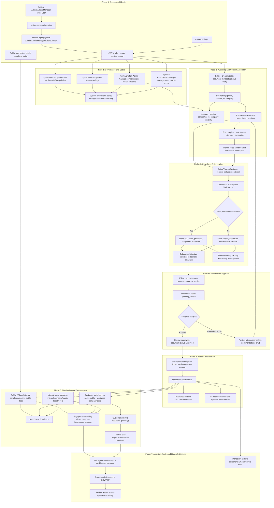

# Platform Workflow (Role-Based, Multi-Phase)

See `diagrams/ROLE_LEGEND.md` for role definitions.

```mermaid
flowchart TB
    subgraph P0["Phase 0: Access and Identity"]
        P0I["System Admin/Admin/Manager invite user"]
        P0A["Invitee accepts invitation"]
        P0L["Internal login (System Admin/Admin/Manager/Editor/Viewer)"]
        P0C["Customer login"]
        P0P["Public user enters public portal (no login)"]
        P0T["JWT + role + tenant context issued"]
    end

    subgraph P1["Phase 1: Governance and Setup"]
        P1R["System Admin updates and publishes RBAC policies"]
        P1S["System Admin updates system settings"]
        P1C["Admin/System Admin manage companies and tenant structure"]
        P1U["System Admin/Admin/Manager manage users by role scope"]
        P1A["System actions and policy changes written to audit log"]
    end

    subgraph P2["Phase 2: Authoring and Content Assembly"]
        P2D["Editor+ create/update document metadata (status draft)"]
        P2V["Set visibility: public, internal, or company"]
        P2AC["Manager+ assign companies for company visibility"]
        P2Ver["Editor+ create and edit unpublished versions"]
        P2Att["Editor+ upload attachments (storage + metadata)"]
        P2Com["Internal roles add threaded comments and replies"]
    end

    subgraph P3["Phase 3: Real-Time Collaboration"]
        P3K["Editor/Viewer/Customer request collaboration token"]
        P3W["Connect to Hocuspocus WebSocket"]
        P3RW{"Write permission available?"}
        P3E["Live CRDT edits, presence, snapshots, auto-save"]
        P3RO["Read-only synchronized collaboration session"]
        P3Y["Debounced Yjs state persisted to backend database"]
        P3S["Session/activity tracking and activity feed updates"]
    end

    subgraph P4["Phase 4: Review and Approval"]
        P4Sub["Editor+ submit review request for current version"]
        P4Pend["Document status pending_review"]
        P4Dec{"Reviewer decision"}
        P4App["Review approved, document status approved"]
        P4Rej["Review rejected/cancelled, document status draft"]
    end

    subgraph P5["Phase 5: Publish and Release"]
        P5Pub["Manager/Admin/System Admin publish approved version"]
        P5Act["Document status active"]
        P5Imm["Published version becomes immutable"]
        P5Not["In-app notifications and optional publish email"]
    end

    subgraph P6["Phase 6: Distribution and Consumption"]
        P6Pub["Public API and Viewer portal serve active public docs"]
        P6Cus["Customer portal serves active public + assigned company docs"]
        P6Int["Internal users consume internal/company/public docs by role"]
        P6Dl["Attachment downloads"]
        P6Eng["Engagement tracking: views, progress, bookmarks, sessions"]
        P6Fb["Customer submits feedback (pending)"]
        P6Resp["Internal staff triage/respond/close feedback"]
    end

    subgraph P7["Phase 7: Analytics, Audit, and Lifecycle Closure"]
        P7Dash["Manager+ open analytics dashboards by scope"]
        P7Exp["Export analytics reports (CSV/PDF)"]
        P7Aud["Review audit trail and operational activity"]
        P7Arc["Manager+ archive documents when lifecycle ends"]
    end

    P0I --> P0A --> P0L
    P0L --> P0T
    P0C --> P0T
    P0P --> P6Pub

    P0T --> P1R
    P0T --> P1S
    P0T --> P1C
    P0T --> P1U
    P1R --> P1A
    P1S --> P1A
    P1C --> P1A
    P1U --> P1A

    P1C --> P2AC
    P0T --> P2D
    P2D --> P2V --> P2Ver --> P2Att --> P2Com
    P2V --> P2AC
    P2Ver --> P3K
    P2Com --> P3K

    P3K --> P3W --> P3RW
    P3RW -->|Yes| P3E --> P3Y
    P3RW -->|No| P3RO --> P3Y
    P3E --> P3S
    P3RO --> P3S

    P3Y --> P4Sub --> P4Pend --> P4Dec
    P4Dec -->|Approve| P4App --> P5Pub
    P4Dec -->|Reject or Cancel| P4Rej --> P2Ver

    P5Pub --> P5Act --> P5Imm
    P5Act --> P5Not
    P5Act --> P6Pub
    P5Act --> P6Cus
    P5Act --> P6Int

    P6Pub --> P6Dl
    P6Cus --> P6Dl
    P6Int --> P6Dl
    P6Pub --> P6Eng
    P6Cus --> P6Eng
    P6Int --> P6Eng
    P6Cus --> P6Fb --> P6Resp

    P6Eng --> P7Dash
    P6Resp --> P7Dash
    P7Dash --> P7Exp --> P7Aud
    P5Act --> P7Arc
```
