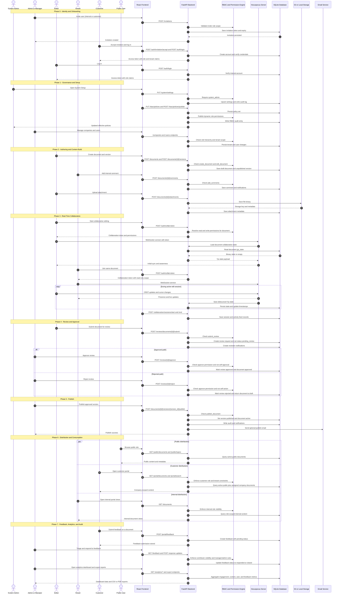

# Platform Sequence (End-to-End, Role-Centric)

See `diagrams/ROLE_LEGEND.md` for role definitions.

```mermaid
sequenceDiagram
    autonumber
    actor SysAdmin as System Admin
    actor AdminManager as Admin or Manager
    actor Editor as Editor
    actor Viewer as Viewer
    actor Customer as Customer
    actor Public as Public User
    participant FE as React Frontend
    participant API as FastAPI Backend
    participant ACL as RBAC and Permission Engine
    participant Collab as Hocuspocus Server
    participant DB as SQLite Database
    participant Store as S3 or Local Storage
    participant Mail as Email Service

    Note over SysAdmin,Public: Phase 0 - Identity and Onboarding
    AdminManager->>FE: Invite user (internal or customer)
    FE->>API: POST /invitations
    API->>ACL: Validate inviter role scope
    API->>DB: Save invitation token and expiry
    DB-->>API: Invitation persisted
    API-->>AdminManager: Invitation created
    Customer->>FE: Accept invitation and log in
    FE->>API: POST /auth/invitation/accept and POST /auth/login
    API->>DB: Create account and verify credentials
    API-->>Customer: Access token with role and tenant claims
    Editor->>FE: Log in
    FE->>API: POST /auth/login
    API->>DB: Verify internal account
    API-->>Editor: Access token with role claims

    Note over SysAdmin,Public: Phase 1 - Governance and Setup
    SysAdmin->>FE: Open System Setup
    FE->>API: PUT /system/settings
    API->>ACL: Require system_admin
    API->>DB: Upsert settings and write audit log
    FE->>API: PUT /rbac/policies and POST /rbac/policies/publish
    API->>DB: Persist policy set
    API->>ACL: Publish dynamic role permissions
    API->>DB: Write RBAC audit entry
    API-->>SysAdmin: Updated effective policies
    AdminManager->>FE: Manage companies and users
    FE->>API: /companies and /users endpoints
    API->>ACL: Check role hierarchy and tenant scope
    API->>DB: Persist tenant and user changes

    Note over SysAdmin,Public: Phase 2 - Authoring and Content Build
    Editor->>FE: Create document and version
    FE->>API: POST /documents and POST /documents/{id}/versions
    API->>ACL: Check create_document and edit_document
    API->>DB: Save draft document and unpublished version
    Viewer->>FE: Add internal comment
    FE->>API: POST /documents/{id}/comments
    API->>ACL: Check add_comments
    API->>DB: Save comment and notifications
    Editor->>FE: Upload attachment
    FE->>API: POST /documents/{id}/attachments
    API->>Store: Save file binary
    Store-->>API: Storage key and metadata
    API->>DB: Save attachment metadata

    Note over SysAdmin,Public: Phase 3 - Real-Time Collaboration
    Editor->>FE: Start collaborative editing
    FE->>API: POST /auth/collab-token
    API->>ACL: Resolve read and write permissions for document
    API-->>Editor: Collaboration token and permissions
    Editor->>Collab: WebSocket connect with token
    Collab->>API: Load document collaboration state
    API->>DB: Read document yjs_state
    DB-->>API: Binary state or empty
    API-->>Collab: Yjs state payload
    Collab-->>Editor: Initial sync and awareness
    Viewer->>FE: Join same document
    FE->>API: POST /auth/collab-token
    API-->>Viewer: Collaboration token with read-only scope
    Viewer->>Collab: WebSocket connect
    loop During active edit session
        Editor->>Collab: CRDT updates and cursor changes
        Collab-->>Viewer: Presence and live updates
        Collab->>API: Save debounced Yjs state
        API->>DB: Persist state and update timestamps
    end
    FE->>API: POST /collaboration/sessions/start and /end
    API->>DB: Save session and activity feed records

    Note over SysAdmin,Public: Phase 4 - Review and Approval
    Editor->>FE: Submit document for review
    FE->>API: POST /reviews/documents/{id}/submit
    API->>ACL: Check submit_review
    API->>DB: Create review request and set status pending_review
    API->>DB: Create reviewer notifications
    alt Approved path
        AdminManager->>FE: Approve review
        FE->>API: POST /reviews/{id}/approve
        API->>ACL: Check approve permission and not self-approval
        API->>DB: Mark review approved and document approved
    else Rejected path
        AdminManager->>FE: Reject review
        FE->>API: POST /reviews/{id}/reject
        API->>ACL: Check approve permission and not self-action
        API->>DB: Mark review rejected and return document to draft
    end

    Note over SysAdmin,Public: Phase 5 - Publish
    AdminManager->>FE: Publish approved version
    FE->>API: POST /documents/{id}/versions/{version_id}/publish
    API->>ACL: Check publish_document
    API->>DB: Set version published and document active
    API->>DB: Write audit and notifications
    API->>Mail: Send optional publish email
    API-->>AdminManager: Publish success

    Note over SysAdmin,Public: Phase 6 - Distribution and Consumption
    par Public distribution
        Public->>FE: Browse public site
        FE->>API: GET /public/documents and /public/topics
        API->>DB: Query active public documents
        API-->>Public: Public content and metadata
    and Customer distribution
        Customer->>FE: Open customer portal
        FE->>API: GET /portal/documents and /portal/search
        API->>ACL: Enforce customer role and tenant constraints
        API->>DB: Query active public plus assigned company documents
        API-->>Customer: Company-scoped content
    and Internal distribution
        Viewer->>FE: Open internal portal views
        FE->>API: GET /documents
        API->>ACL: Enforce internal role visibility
        API->>DB: Query role-scoped internal content
        API-->>Viewer: Internal document views
    end

    Note over SysAdmin,Public: Phase 7 - Feedback, Analytics, and Audit
    Customer->>FE: Submit feedback on a document
    FE->>API: POST /portal/feedback
    API->>DB: Create feedback with pending status
    API-->>Customer: Feedback submission stored
    AdminManager->>FE: Triage and respond to feedback
    FE->>API: GET /feedback and POST response updates
    API->>ACL: Enforce contributor visibility and manager/admin rules
    API->>DB: Update feedback status to responded or closed
    AdminManager->>FE: Open analytics dashboard and export reports
    FE->>API: GET /analytics/* and export endpoints
    API->>DB: Aggregate engagement, content, user, and feedback metrics
    API-->>AdminManager: Dashboard data and CSV or PDF exports
```
