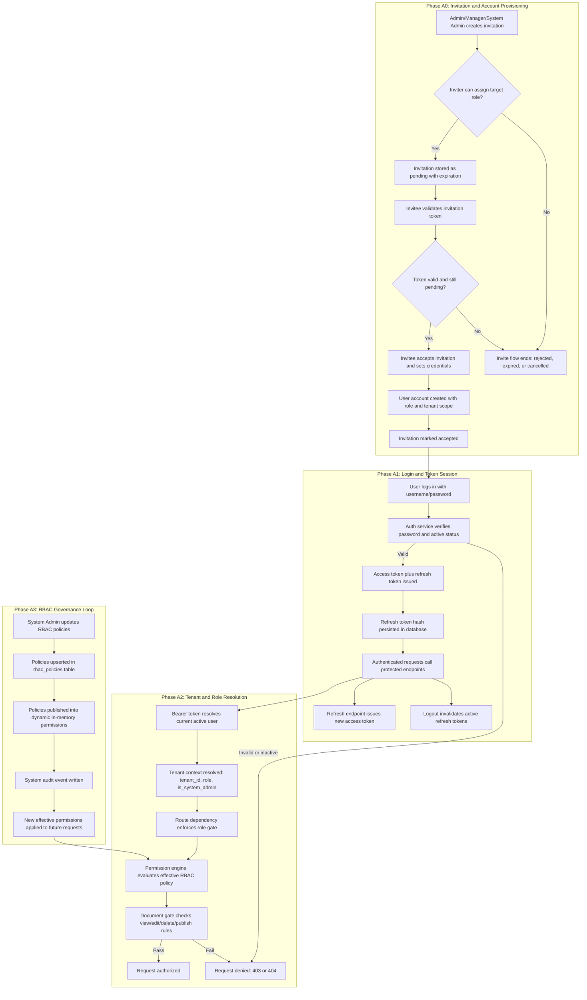

# Deep Dive A: Auth and RBAC

See `diagrams/ROLE_LEGEND.md` for role definitions.

```mermaid
flowchart TB
    subgraph A0["Phase A0: Invitation and Account Provisioning"]
        A0I["Admin/Manager/System Admin creates invitation"]
        A0R{"Inviter can assign target role?"}
        A0P["Invitation stored as pending with expiration"]
        A0V["Invitee validates invitation token"]
        A0E{"Token valid and still pending?"}
        A0U["Invitee accepts invitation and sets credentials"]
        A0C["User account created with role and tenant scope"]
        A0M["Invitation marked accepted"]
        A0X["Invite flow ends: rejected, expired, or cancelled"]
    end

    subgraph A1["Phase A1: Login and Token Session"]
        A1L["User logs in with username/password"]
        A1K["Auth service verifies password and active status"]
        A1T["Access token plus refresh token issued"]
        A1H["Refresh token hash persisted in database"]
        A1Me["Authenticated requests call protected endpoints"]
        A1Rf["Refresh endpoint issues new access token"]
        A1Lo["Logout invalidates active refresh tokens"]
    end

    subgraph A2["Phase A2: Tenant and Role Resolution"]
        A2B["Bearer token resolves current active user"]
        A2Tc["Tenant context resolved: tenant_id, role, is_system_admin"]
        A2D["Route dependency enforces role gate"]
        A2P["Permission engine evaluates effective RBAC policy"]
        A2Doc["Document gate checks view/edit/delete/publish rules"]
        A2OK["Request authorized"]
        A2No["Request denied: 403 or 404"]
    end

    subgraph A3["Phase A3: RBAC Governance Loop"]
        A3S["System Admin updates RBAC policies"]
        A3Db["Policies upserted in rbac_policies table"]
        A3Pub["Policies published into dynamic in-memory permissions"]
        A3Aud["System audit event written"]
        A3Eff["New effective permissions applied to future requests"]
    end

    A0I --> A0R
    A0R -->|Yes| A0P --> A0V --> A0E
    A0R -->|No| A0X
    A0E -->|Yes| A0U --> A0C --> A0M --> A1L
    A0E -->|No| A0X

    A1L --> A1K
    A1K -->|Valid| A1T --> A1H --> A1Me
    A1K -->|Invalid or inactive| A2No
    A1Me --> A1Rf
    A1Me --> A1Lo

    A1Me --> A2B --> A2Tc --> A2D --> A2P --> A2Doc
    A2Doc -->|Pass| A2OK
    A2Doc -->|Fail| A2No

    A3S --> A3Db --> A3Pub --> A3Aud --> A3Eff --> A2P
```
