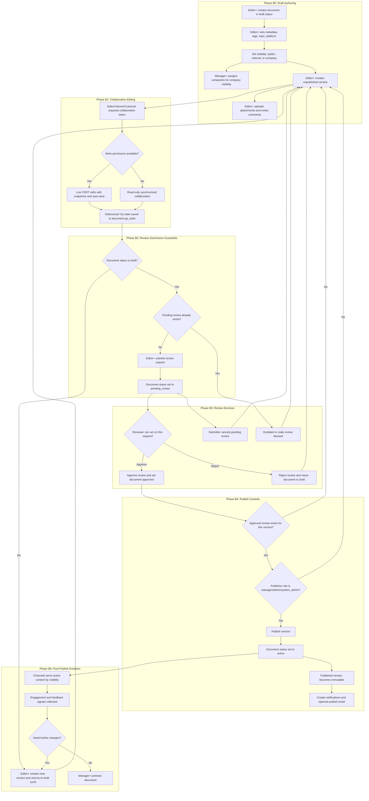

# Deep Dive B: Content Lifecycle and Release Control

See `diagrams/ROLE_LEGEND.md` for role definitions.

```mermaid
flowchart TB
    subgraph B0["Phase B0: Draft Authoring"]
        B0Create["Editor+ creates document in draft status"]
        B0Meta["Editor+ sets metadata, tags, topic, platform"]
        B0Vis["Set visibility: public, internal, or company"]
        B0Assign["Manager+ assigns companies for company visibility"]
        B0Ver["Editor+ creates unpublished version"]
        B0Att["Editor+ uploads attachments and writes comments"]
    end

    subgraph B1["Phase B1: Collaborative Editing"]
        B1Token["Editor/Viewer/Customer requests collaboration token"]
        B1Mode{"Write permission available?"}
        B1Write["Live CRDT edits with snapshots and auto-save"]
        B1Read["Read-only synchronized collaboration"]
        B1Persist["Debounced Yjs state saved to document.yjs_state"]
    end

    subgraph B2["Phase B2: Review Submission Guardrails"]
        B2Draft{"Document status is draft?"}
        B2Pending{"Pending review already exists?"}
        B2Submit["Editor+ submits review request"]
        B2State["Document status set to pending_review"]
    end

    subgraph B3["Phase B3: Review Decision"]
        B3Gate{"Reviewer can act on this request?"}
        B3Approve["Approve review and set document approved"]
        B3Reject["Reject review and return document to draft"]
        B3Cancel["Submitter cancels pending review"]
        B3Conflict["Outdated or stale review blocked"]
    end

    subgraph B4["Phase B4: Publish Controls"]
        B4Approved{"Approved review exists for this version?"}
        B4Role{"Publisher role is manager/admin/system_admin?"}
        B4Publish["Publish version"]
        B4Active["Document status set to active"]
        B4Immutable["Published version becomes immutable"]
        B4Notify["Create notifications and optional publish email"]
    end

    subgraph B5["Phase B5: Post-Publish Evolution"]
        B5Serve["Channels serve active content by visibility"]
        B5Signal["Engagement and feedback signals collected"]
        B5Change{"Need further changes?"}
        B5New["Editor+ creates new version and returns to draft cycle"]
        B5Archive["Manager+ archives document"]
    end

    B0Create --> B0Meta --> B0Vis --> B0Ver --> B0Att
    B0Vis --> B0Assign

    B0Ver --> B1Token --> B1Mode
    B1Mode -->|Yes| B1Write --> B1Persist
    B1Mode -->|No| B1Read --> B1Persist

    B1Persist --> B2Draft
    B2Draft -->|Yes| B2Pending
    B2Draft -->|No| B5New
    B2Pending -->|No| B2Submit --> B2State
    B2Pending -->|Yes| B3Conflict

    B2State --> B3Gate
    B3Gate -->|Approve| B3Approve
    B3Gate -->|Reject| B3Reject
    B2State --> B3Cancel
    B3Conflict --> B0Ver
    B3Reject --> B0Ver
    B3Cancel --> B0Ver

    B3Approve --> B4Approved
    B4Approved -->|Yes| B4Role
    B4Approved -->|No| B0Ver
    B4Role -->|Yes| B4Publish --> B4Active --> B4Immutable --> B4Notify
    B4Role -->|No| B0Ver

    B4Active --> B5Serve --> B5Signal --> B5Change
    B5Change -->|Yes| B5New --> B0Ver
    B5Change -->|No| B5Archive
```
