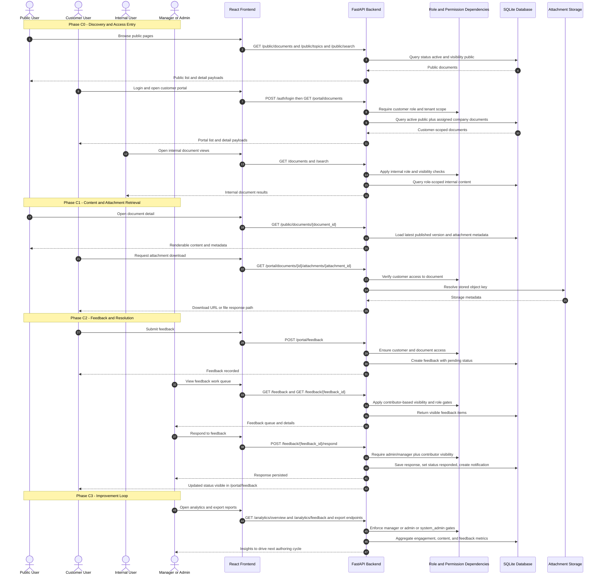

# Deep Dive C: Customer and Public Consumption Loop

See `diagrams/ROLE_LEGEND.md` for role definitions.

```mermaid
sequenceDiagram
    autonumber
    actor Public as Public User
    actor Customer as Customer User
    actor Internal as Internal User
    actor Manager as Manager or Admin
    participant FE as React Frontend
    participant API as FastAPI Backend
    participant ACL as Role and Permission Dependencies
    participant DB as SQLite Database
    participant Store as Attachment Storage

    Note over Public,Manager: Phase C0 - Discovery and Access Entry
    Public->>FE: Browse public pages
    FE->>API: GET /public/documents and /public/topics and /public/search
    API->>DB: Query status active and visibility public
    DB-->>API: Public documents
    API-->>Public: Public list and detail payloads

    Customer->>FE: Login and open customer portal
    FE->>API: POST /auth/login then GET /portal/documents
    API->>ACL: Require customer role and tenant scope
    API->>DB: Query active public plus assigned company documents
    DB-->>API: Customer-scoped documents
    API-->>Customer: Portal list and detail payloads

    Internal->>FE: Open internal document views
    FE->>API: GET /documents and /search
    API->>ACL: Apply internal role and visibility checks
    API->>DB: Query role-scoped internal content
    API-->>Internal: Internal document results

    Note over Public,Manager: Phase C1 - Content and Attachment Retrieval
    Public->>FE: Open document detail
    FE->>API: GET /public/documents/{document_id}
    API->>DB: Load latest published version and attachment metadata
    API-->>Public: Renderable content and metadata

    Customer->>FE: Request attachment download
    FE->>API: GET /portal/documents/{id}/attachments/{attachment_id}
    API->>ACL: Verify customer access to document
    API->>Store: Resolve stored object key
    Store-->>API: Storage metadata
    API-->>Customer: Download URL or file response path

    Note over Public,Manager: Phase C2 - Feedback and Resolution
    Customer->>FE: Submit feedback
    FE->>API: POST /portal/feedback
    API->>ACL: Ensure customer and document access
    API->>DB: Create feedback with pending status
    API-->>Customer: Feedback recorded

    Manager->>FE: View feedback work queue
    FE->>API: GET /feedback and GET /feedback/{feedback_id}
    API->>ACL: Apply contributor-based visibility and role gates
    API->>DB: Return visible feedback items
    API-->>Manager: Feedback queue and details

    Manager->>FE: Respond to feedback
    FE->>API: POST /feedback/{feedback_id}/respond
    API->>ACL: Require admin/manager plus contributor visibility
    API->>DB: Save response, set status responded, create notification
    API-->>Manager: Response persisted
    API-->>Customer: Updated status visible in /portal/feedback

    Note over Public,Manager: Phase C3 - Improvement Loop
    Manager->>FE: Open analytics and export reports
    FE->>API: GET /analytics/overview and /analytics/feedback and export endpoints
    API->>ACL: Enforce manager or admin or system_admin gates
    API->>DB: Aggregate engagement, content, and feedback metrics
    API-->>Manager: Insights to drive next authoring cycle
```
