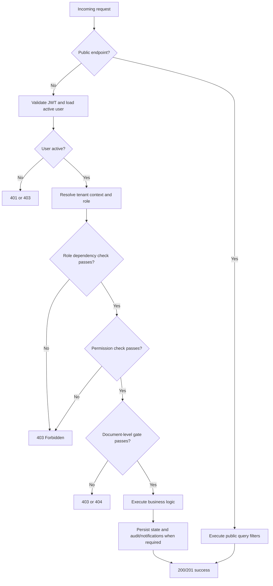
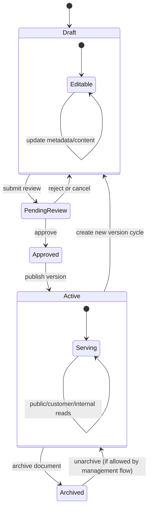
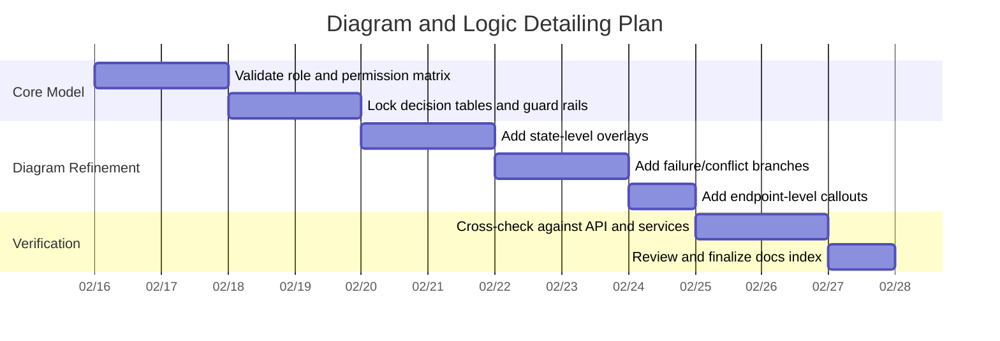

# Detailed Logic and Execution Plan

This document expands the diagram set into concrete rule logic, decision tables, guard rails, and an execution plan.

See also:
- `diagrams/01_PLATFORM_WORKFLOW.md`
- `diagrams/02_PLATFORM_SEQUENCE.md`
- `diagrams/03_AUTH_RBAC_WORKFLOW.md`
- `diagrams/04_CONTENT_LIFECYCLE_WORKFLOW.md`
- `diagrams/05_CUSTOMER_PUBLIC_CONSUMPTION_SEQUENCE.md`
- `diagrams/SOURCE_MAPPING.md`

## 1) Logic Deep Dive

## 1.1 Request Authorization Decision Chain

## 1.2 Effective RBAC Resolution

1. If dynamic RBAC policies exist for role `R`, use dynamic set.
2. Else use static `ROLE_PERMISSIONS[R]`.
3. Reject if user is inactive.
4. Apply role helper checks (`require_system_admin`, `require_manager`, `require_admin`, `require_internal_user`, `require_customer`).
5. Apply document-level checks (`can_view_document`, `can_edit_document`, `can_delete_document`, `can_publish_document`, `can_review_document`).

## 1.3 Document Visibility Decision Table

| Document Visibility | Status | Anonymous/Public | Internal User | Customer |
|---|---|---|---|---|
| `PUBLIC` | `ACTIVE` | Allow | Allow | Allow |
| `PUBLIC` | Not active | Deny | Allow (internal preview/edit flow) | Deny |
| `INTERNAL` | Any | Deny | Allow | Deny |
| `COMPANY` | Any | Deny | Allow | Allow only if customer `tenant_id` is assigned to doc |

Notes:
- Public APIs additionally query `status == ACTIVE` and `visibility == PUBLIC`.
- Customer portal queries only `ACTIVE` docs and filters to `PUBLIC` or assigned `COMPANY`.

## 1.4 Edit/Delete/Publish Decision Table

| Action | Base Permission Needed | Tenant Constraint | Special Case |
|---|---|---|---|
| Edit document | `edit_document` | Same tenant unless `system_admin` | Inactive users always denied |
| Delete document | `delete_document` | Same tenant unless `system_admin` | Editors/viewers/customers denied by permission |
| Publish document/version | `publish_document` | Same tenant unless `system_admin` | Publish also requires approved review for target version |

## 1.5 Review Workflow Guard Rails

| Guard | Condition | Result |
|---|---|---|
| Submit only from draft | `document.status != draft` | Reject submit |
| No duplicate pending review | Existing pending review for document | Reject submit |
| Version must be valid | Submitted `version_id` not found or already published | Reject submit |
| Reviewer cannot self-approve | `review.submitted_by == current_user.id` | Reject approve/reject |
| Reject stale version approval | Newer version exists than review target | Reject approval |
| Reject publish without approval | No latest review or status != approved | Reject publish |
| Approved version immutability | `version.is_published == true` | Reject update/delete |

## 1.6 Collaboration Logic (Token, Mode, Persistence)

| Step | Condition | Behavior |
|---|---|---|
| Token issue | User can read document | Return collab JWT with permissions array |
| WS auth | Token valid and `document_id` matches | Connect user |
| Mode selection | `write` permission present | Editable session |
| Mode selection | `write` missing, `read` present | Read-only session |
| Initial load | Stored `yjs_state` exists | Hydrate document from backend state |
| Save cycle | Debounce window elapsed | Persist updated `yjs_state` via backend |
| Disconnect | Last user leaves document | Clear doc token/cache in collab server |

## 1.7 Feedback Visibility Rules

| Viewer Type | Can See Feedback? |
|---|---|
| Feedback author (customer) | Yes (own feedback) |
| System admin | Yes (all) |
| Internal staff contributor to target document | Yes |
| Internal staff not contributor | No |

For response operations:
- `POST /feedback/{id}/respond` requires admin or manager role plus contributor visibility.

## 1.8 Error and Conflict Paths (Expected)

| Condition | Typical Status |
|---|---|
| Invalid credentials/token | `401` |
| Valid user but insufficient role/permission | `403` |
| Resource absent or hidden by scope | `404` |
| Duplicate or invalid workflow transition | `409` |
| Validation errors (payload/business rule) | `400` or `422` |

## 2) State-Level Logic Model

Version state overlay:
- `Unpublished` -> `Published (immutable)`
- published version cannot be edited or deleted.

## 3) Detailed Phase Plan (Operational)

| Phase | Owners | Entry Criteria | Core Logic | Exit Criteria |
|---|---|---|---|---|
| P0 Access/Identity | Admin/Manager/System Admin + Invitee | Invite requested or login attempt | Invitation validation, account provisioning, token issue | User has valid role-bound session |
| P1 Governance | System Admin + Admin | Authenticated admin context | System settings update, RBAC upsert/publish, audit logging | Effective policies loaded and auditable |
| P2 Authoring | Editor+ | User has create/edit permission | Draft creation, metadata, visibility, attachments, comments | Draft content and candidate versions exist |
| P3 Collaboration | Editor/Viewer/Customer | Document read access and collab token | WS auth, read/write mode, CRDT sync, yjs persistence | Consistent collaborative state stored |
| P4 Review | Editor+ + Reviewer | Draft version ready | Submit, pending state, approve/reject/cancel rules | Review status final for current request |
| P5 Publish | Manager/Admin/System Admin | Approved latest review for version | Publish checks, immutable flip, active state, notifications | Version published, document active |
| P6 Consumption | Public/Customer/Internal | Active content exists | Scope-filtered retrieval, attachment access, feedback capture | Consumption metrics and feedback generated |
| P7 Analytics/Audit | Manager+ and System Admin | Operational data accumulated | Aggregations, exports, audit review, lifecycle closure | Decisions fed back into next authoring cycle |

## 4) Execution Plan (Work Packages)

## 4.1 Delivery Order

## 4.2 Acceptance Criteria

1. Every major role has explicit action and constraints documented.
2. Every major phase has entry and exit criteria.
3. Critical decision points include deny paths and status outcomes.
4. Review/publish and collaboration flows include immutability and conflict checks.
5. Public/customer/internal visibility logic is explicitly represented.
6. Diagrams and tables map back to current source files in `diagrams/SOURCE_MAPPING.md`.

## 4.3 Maintenance Plan

1. Update diagram files whenever endpoint contracts or role permissions change.
2. Refresh decision tables when RBAC defaults or dynamic policy behavior changes.
3. Validate documentation against:
   - `backend/app/services/permissions.py`
   - `backend/app/api/management/reviews.py`
   - `backend/app/services/version_service.py`
   - `backend/app/api/portal/*.py`
   - `backend/app/api/public/*.py`
4. Keep `diagrams/SOURCE_MAPPING.md` synchronized with new modules.
