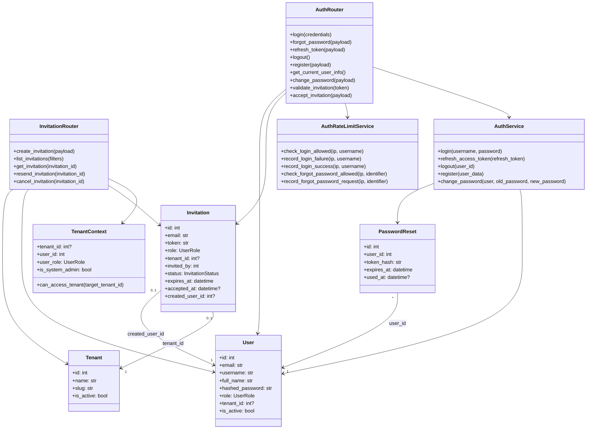

# P0: Access and Identity - Class Diagram

```mermaid
classDiagram
    class AuthRouter {
        +login(credentials)
        +forgot_password(payload)
        +refresh_token(payload)
        +logout()
        +register(payload)
        +get_current_user_info()
        +change_password(payload)
        +validate_invitation(token)
        +accept_invitation(payload)
    }

    class InvitationRouter {
        +create_invitation(payload)
        +list_invitations(filters)
        +get_invitation(invitation_id)
        +resend_invitation(invitation_id)
        +cancel_invitation(invitation_id)
    }

    class AuthService {
        +login(username, password)
        +refresh_access_token(refresh_token)
        +logout(user_id)
        +register(user_data)
        +change_password(user, old_password, new_password)
    }

    class AuthRateLimitService {
        +check_login_allowed(ip, username)
        +record_login_failure(ip, username)
        +record_login_success(ip, username)
        +check_forgot_password_allowed(ip, identifier)
        +record_forgot_password_request(ip, identifier)
    }

    class TenantContext {
        +tenant_id: int?
        +user_id: int
        +user_role: UserRole
        +is_system_admin: bool
        +can_access_tenant(target_tenant_id)
    }

    class User {
        +id: int
        +email: str
        +username: str
        +full_name: str
        +hashed_password: str
        +role: UserRole
        +tenant_id: int?
        +is_active: bool
    }

    class Invitation {
        +id: int
        +email: str
        +token: str
        +role: UserRole
        +tenant_id: int?
        +invited_by: int
        +status: InvitationStatus
        +expires_at: datetime
        +accepted_at: datetime?
        +created_user_id: int?
    }

    class PasswordReset {
        +id: int
        +user_id: int
        +token_hash: str
        +expires_at: datetime
        +used_at: datetime?
    }

    class Tenant {
        +id: int
        +name: str
        +slug: str
        +is_active: bool
    }

    AuthRouter --> AuthService
    AuthRouter --> AuthRateLimitService
    AuthRouter --> Invitation
    AuthRouter --> User
    InvitationRouter --> TenantContext
    InvitationRouter --> Invitation
    InvitationRouter --> User
    InvitationRouter --> Tenant
    AuthService --> User
    AuthService --> PasswordReset
    Invitation "0..1" --> "1" Tenant : tenant_id
    Invitation "0..1" --> "1" User : created_user_id
    PasswordReset "*" --> "1" User : user_id
```
