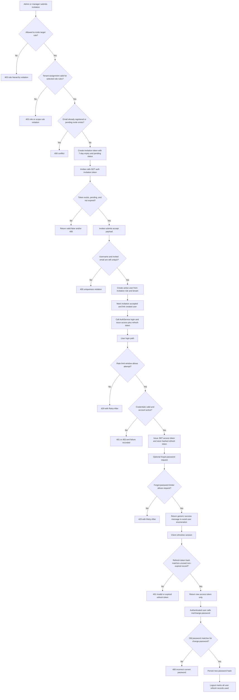

# P0: Access and Identity - Flow Diagram

```mermaid
flowchart TD
    A[Admin or manager submits invitation] --> B{Allowed to invite target role?}
    B -- No --> B1[403 role hierarchy violation]
    B -- Yes --> C{Tenant assignment valid for selected role rules?}
    C -- No --> C1[403 role or scope rule violation]
    C -- Yes --> D{Email already registered or pending invite exists?}
    D -- Yes --> D1[400 conflict]
    D -- No --> E[Create invitation token with 7-day expiry and pending status]

    E --> F[Invitee calls GET auth invitation token]
    F --> G{Token exists, pending, and not expired?}
    G -- No --> G1[Return valid false and/or 400]
    G -- Yes --> H[Invitee submits accept payload]
    H --> I{Username and invited email are still unique?}
    I -- No --> I1[400 uniqueness violation]
    I -- Yes --> J[Create active user from invitation role and tenant]
    J --> K[Mark invitation accepted and link created user]
    K --> L[Call AuthService login and issue access plus refresh token]

    L --> M[User login path]
    M --> N{Rate limit window allows attempt?}
    N -- No --> N1[429 with Retry-After]
    N -- Yes --> O{Credentials valid and account active?}
    O -- No --> O1[401 or 403 and failure recorded]
    O -- Yes --> P[Issue JWT access token and store hashed refresh token]

    P --> Q[Optional forgot-password request]
    Q --> R{Forgot-password limiter allows request?}
    R -- No --> R1[429 with Retry-After]
    R -- Yes --> S[Return generic success message to avoid user enumeration]

    S --> T[Client refreshes session]
    T --> U{Refresh token hash matches unused non-expired record?}
    U -- No --> U1[401 invalid or expired refresh token]
    U -- Yes --> V[Return new access token only]

    V --> W[Authenticated user calls me/change-password]
    W --> X{Old password matches for change-password?}
    X -- No --> X1[400 incorrect current password]
    X -- Yes --> Y[Persist new password hash]
    Y --> Z[Logout marks all user refresh records used]
```
