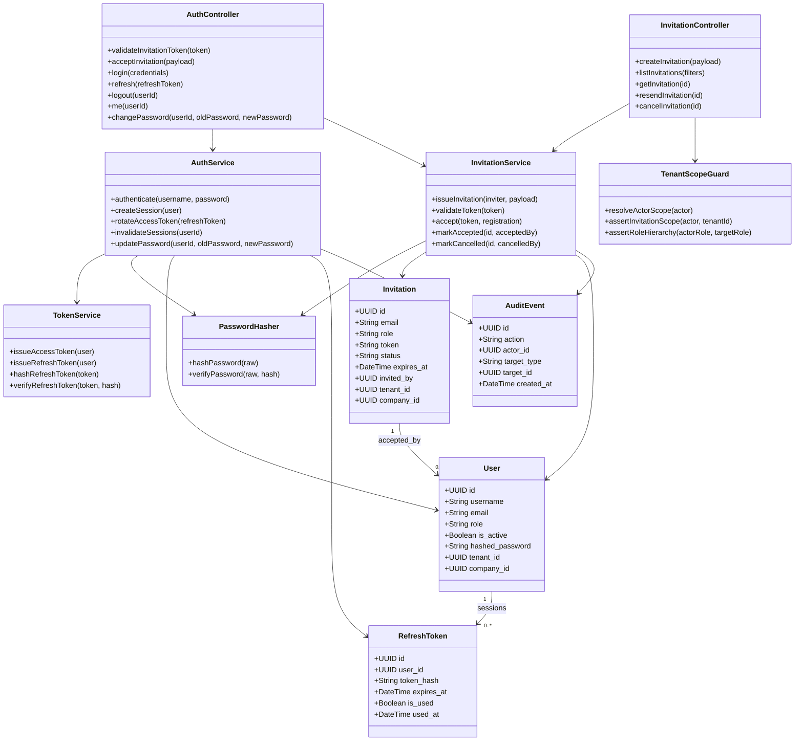
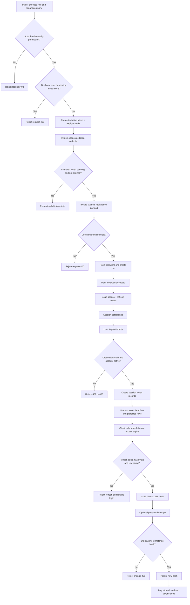
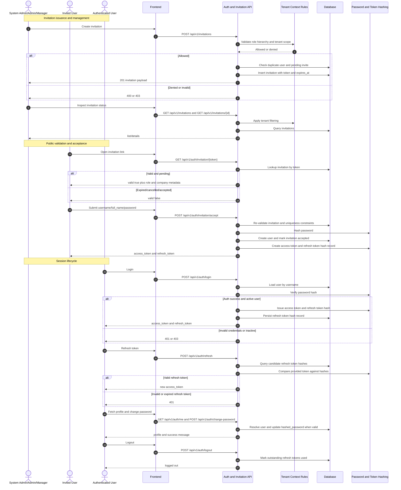

# P0: Access and Identity (Endpoint-Level Phase Pack)

## Scope

Phase `P0` covers invitation lifecycle, account provisioning, login, token refresh, and session/logout behavior.

## Endpoint Inventory

| Method | Endpoint | Primary Actors | Guard |
|---|---|---|---|
| `POST` | `/invitations` | System Admin, Admin, Manager | Authenticated role hierarchy checks |
| `GET` | `/invitations` | System Admin, Admin, Manager | Tenant-scoped unless system admin |
| `GET` | `/invitations/{id}` | System Admin, Admin, Manager | Tenant-scoped unless system admin |
| `POST` | `/invitations/{id}/resend` | System Admin, Admin, Manager | Cannot resend accepted invite |
| `DELETE` | `/invitations/{id}` | System Admin, Admin, Manager | Pending only |
| `GET` | `/auth/invitation/{token}` | Public | Token validity/expiry check |
| `POST` | `/auth/invitation/accept` | Public invitee | Token valid + email/username uniqueness |
| `POST` | `/auth/login` | All users | Password + active status |
| `POST` | `/auth/refresh` | All users | Valid non-expired refresh token hash |
| `POST` | `/auth/logout` | Authenticated user | Marks refresh tokens used |
| `GET` | `/auth/me` | Authenticated user | Active token required |
| `POST` | `/auth/change-password` | Authenticated user | Old password must match |

## Domain Class Diagram

## Phase Flow Diagram

## Endpoint Sequence Diagram

