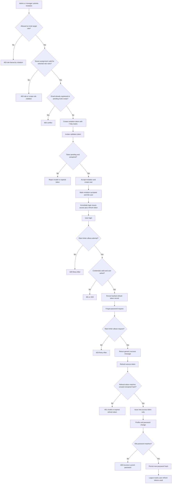
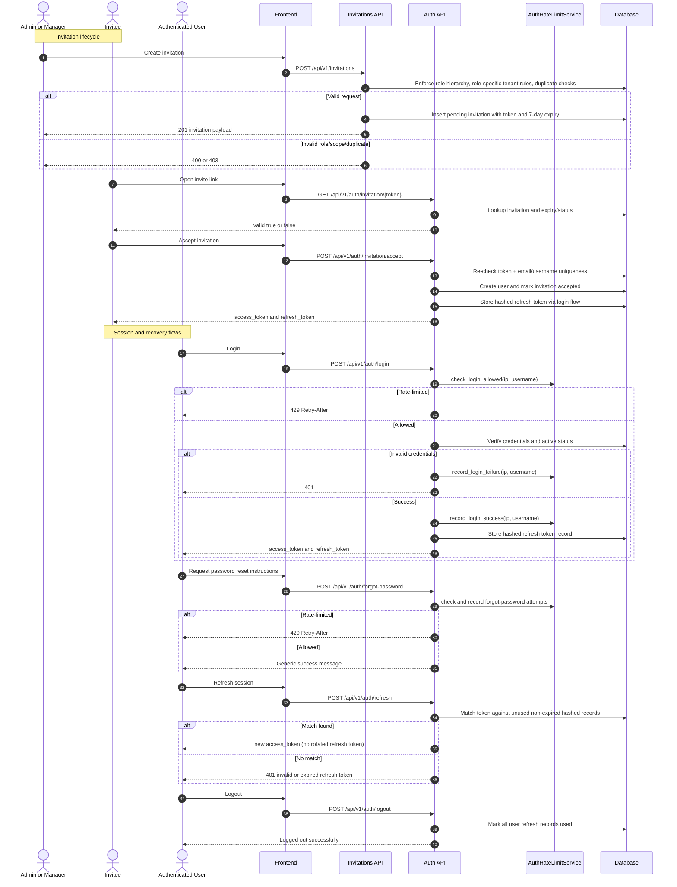

# P0: Access and Identity (Endpoint-Level Phase Pack)

## Scope

Phase `P0` covers invitation management, invitation acceptance, account bootstrap, login/session lifecycle, and password self-service endpoints.

## Endpoint Inventory

| Method | Endpoint | Primary Actors | Guard |
|---|---|---|---|
| `POST` | `/invitations` | System Admin, Admin, Manager | Role hierarchy + role-specific tenant assignment rules + duplicate email/invite checks |
| `GET` | `/invitations` | System Admin, Admin, Manager | Non-system-admin users are tenant-scoped |
| `GET` | `/invitations/{id}` | System Admin, Admin, Manager | Non-system-admin users are tenant-scoped |
| `POST` | `/invitations/{id}/resend` | System Admin, Admin, Manager | Cannot resend accepted invite; email must still be unregistered |
| `DELETE` | `/invitations/{id}` | System Admin, Admin, Manager | Pending only |
| `GET` | `/auth/invitation/{token}` | Public invitee | Token must exist, be pending, and not expired |
| `POST` | `/auth/invitation/accept` | Public invitee | Token valid + username/email uniqueness |
| `POST` | `/auth/register` | Public | Email/username uniqueness (role trusted from request payload) |
| `POST` | `/auth/login` | All users | Optional auth rate limiting + credential and active checks |
| `POST` | `/auth/forgot-password` | Public | Optional auth rate limiting + generic non-enumerating response |
| `POST` | `/auth/refresh` | All users | Refresh token hash must match unused, non-expired record |
| `POST` | `/auth/logout` | Authenticated user | Marks all user refresh records as used |
| `GET` | `/auth/me` | Authenticated user | Active access token required |
| `POST` | `/auth/change-password` | Authenticated user | Old password hash must match |

## Domain Class Diagram

```mermaid
classDiagram
    class AuthRouter {
        +POST /auth/login
        +POST /auth/forgot-password
        +POST /auth/refresh
        +POST /auth/logout
        +POST /auth/register
        +GET /auth/me
        +POST /auth/change-password
        +GET /auth/invitation/{token}
        +POST /auth/invitation/accept
    }

    class InvitationRouter {
        +POST /invitations
        +GET /invitations
        +GET /invitations/{id}
        +POST /invitations/{id}/resend
        +DELETE /invitations/{id}
    }

    class AuthService {
        +login(username, password)
        +refresh_access_token(refresh_token)
        +logout(user_id)
        +register(user_data)
        +change_password(user, old_password, new_password)
    }

    class AuthRateLimitService {
        +check_login_allowed(ip, username)
        +record_login_failure(ip, username)
        +record_login_success(ip, username)
        +check_forgot_password_allowed(ip, identifier)
        +record_forgot_password_request(ip, identifier)
    }

    class TenantContext {
        +tenant_id: int?
        +user_id: int
        +user_role: UserRole
        +is_system_admin: bool
    }

    class User {
        +id: int
        +email: str
        +username: str
        +full_name: str
        +hashed_password: str
        +role: UserRole
        +tenant_id: int?
        +is_active: bool
    }

    class Invitation {
        +id: int
        +email: str
        +token: str
        +role: UserRole
        +tenant_id: int?
        +invited_by: int
        +status: InvitationStatus
        +expires_at: datetime
        +accepted_at: datetime?
        +created_user_id: int?
    }

    class PasswordReset {
        +id: int
        +user_id: int
        +token_hash: str
        +expires_at: datetime
        +used_at: datetime?
    }

    class Tenant {
        +id: int
        +name: str
        +slug: str
    }

    AuthRouter --> AuthService
    AuthRouter --> AuthRateLimitService
    InvitationRouter --> TenantContext
    InvitationRouter --> Invitation
    AuthService --> User
    AuthService --> PasswordReset
    Invitation "0..1" --> "1" Tenant : tenant_id
```

## Phase Flow Diagram



## Endpoint Sequence Diagram


