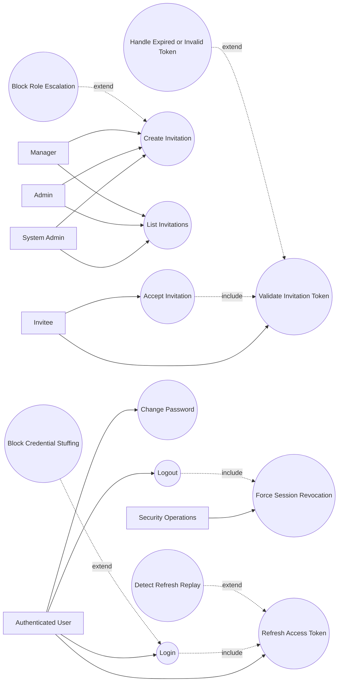

# P0: Access and Identity - Use Case Diagram

## Actors

- `System Admin`
- `Admin`
- `Manager`
- `Invitee`
- `Authenticated User`
- `Security Operations`

## Regular Use Cases

1. Inviter creates invitation for target role.
2. Inviter lists and tracks invitation status.
3. Invitee validates invitation token from public link.
4. Invitee accepts invitation and creates account.
5. User logs in and receives access/refresh tokens.
6. User refreshes access token with valid refresh token.
7. User reads own profile and changes password.
8. User logs out and invalidates active refresh sessions.

## Extreme and Edge Use Cases

1. Expired, cancelled, or already-accepted invitation token is used.
2. Inviter attempts role escalation outside role hierarchy.
3. Username/email collision occurs during invitation acceptance.
4. Brute-force login attempts trigger security controls.
5. Replay attack attempts reuse consumed refresh token.
6. Suspicious session pattern triggers forced logout.
7. Password change attempts with incorrect current password.
8. Cross-tenant invitation visibility attempt is blocked.

