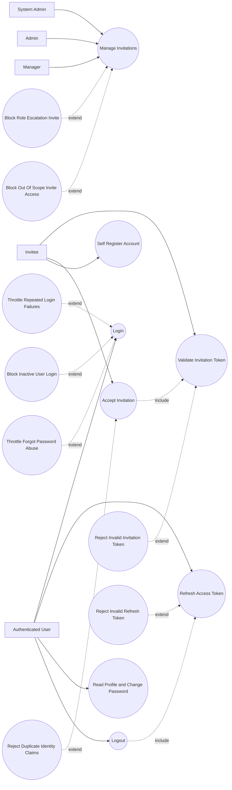

# P0: Access and Identity - Use Case Diagram

## Actors

- `System Admin`
- `Admin`
- `Manager`
- `Invitee`
- `Authenticated User`

## Regular Use Cases

1. Admin/manager creates and manages invitations.
2. Invitee validates invitation token.
3. Invitee accepts invitation and provisions account.
4. Public user self-registers with unique email/username.
5. User logs in and receives access and refresh tokens.
6. User refreshes access token with a valid refresh token.
7. User reads profile and changes password.
8. User logs out and invalidates stored refresh sessions.

## Extreme and Edge Use Cases

1. Expired, cancelled, or used invitation token is submitted.
2. Invitation acceptance fails due to existing email or username.
3. Inviter attempts role escalation outside hierarchy bounds.
4. Non-system actor attempts out-of-scope invitation operation.
5. Repeated failed login attempts trigger rate limiting.
6. Refresh token is invalid, expired, or already invalidated.
7. Inactive account attempts login.
8. Forgot-password endpoint receives abusive request volume.

