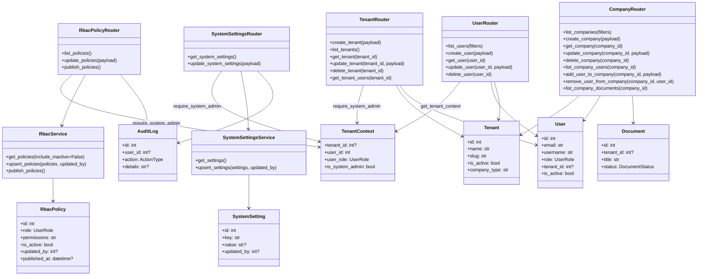

# P1: Governance and Setup - Class Diagram

```mermaid
classDiagram
    class RbacPolicyRouter {
        +list_policies()
        +update_policies(payload)
        +publish_policies()
    }

    class SystemSettingsRouter {
        +get_system_settings()
        +update_system_settings(payload)
    }

    class TenantRouter {
        +create_tenant(payload)
        +list_tenants()
        +get_tenant(tenant_id)
        +update_tenant(tenant_id, payload)
        +delete_tenant(tenant_id)
        +get_tenant_users(tenant_id)
    }

    class CompanyRouter {
        +list_companies(filters)
        +create_company(payload)
        +get_company(company_id)
        +update_company(company_id, payload)
        +delete_company(company_id)
        +list_company_users(company_id)
        +add_user_to_company(company_id, payload)
        +remove_user_from_company(company_id, user_id)
        +list_company_documents(company_id)
    }

    class UserRouter {
        +list_users(filters)
        +create_user(payload)
        +get_user(user_id)
        +update_user(user_id, payload)
        +delete_user(user_id)
    }

    class RbacService {
        +get_policies(include_inactive=False)
        +upsert_policies(policies, updated_by)
        +publish_policies()
    }

    class SystemSettingsService {
        +get_settings()
        +upsert_settings(settings, updated_by)
    }

    class TenantContext {
        +tenant_id: int?
        +user_id: int
        +user_role: UserRole
        +is_system_admin: bool
    }

    class RbacPolicy {
        +id: int
        +role: UserRole
        +permissions: str
        +is_active: bool
        +updated_by: int?
        +published_at: datetime?
    }

    class SystemSetting {
        +id: int
        +key: str
        +value: str?
        +updated_by: int?
    }

    class Tenant {
        +id: int
        +name: str
        +slug: str
        +is_active: bool
        +company_type: str
    }

    class User {
        +id: int
        +email: str
        +username: str
        +role: UserRole
        +tenant_id: int?
        +is_active: bool
    }

    class Document {
        +id: int
        +tenant_id: int?
        +title: str
        +status: DocumentStatus
    }

    class AuditLog {
        +id: int
        +user_id: int?
        +action: ActionType
        +details: str?
    }

    RbacPolicyRouter --> TenantContext : require_system_admin
    RbacPolicyRouter --> RbacService
    RbacPolicyRouter --> AuditLog
    SystemSettingsRouter --> TenantContext : require_system_admin
    SystemSettingsRouter --> SystemSettingsService
    SystemSettingsRouter --> AuditLog
    TenantRouter --> TenantContext : require_system_admin
    TenantRouter --> Tenant
    TenantRouter --> User
    CompanyRouter --> Tenant
    CompanyRouter --> User
    CompanyRouter --> Document
    UserRouter --> TenantContext : get_tenant_context
    UserRouter --> User
    UserRouter --> Tenant
    RbacService --> RbacPolicy
    SystemSettingsService --> SystemSetting
```
