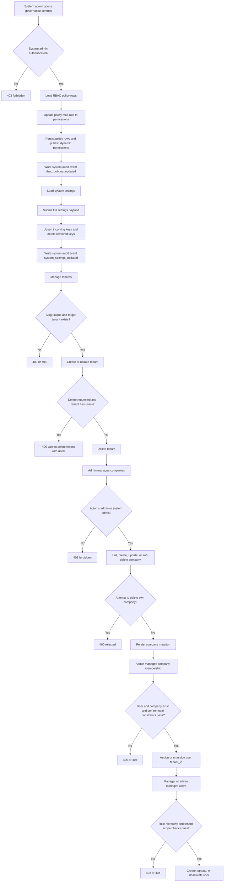

# P1: Governance and Setup - Flow Diagram

```mermaid
flowchart TD
    A[System admin opens governance controls] --> B{System admin authenticated?}
    B -- No --> B1[403 forbidden]
    B -- Yes --> C[Load RBAC policy rows]
    C --> D[Update policy map role to permissions]
    D --> E[Persist policy rows and publish dynamic permissions]
    E --> F[Write system audit event rbac_policies_updated]

    F --> G[Load system settings]
    G --> H[Submit full settings payload]
    H --> I[Upsert incoming keys and delete removed keys]
    I --> J[Write system audit event system_settings_updated]

    J --> K[Manage tenants]
    K --> L{Slug unique and target tenant exists?}
    L -- No --> L1[400 or 404]
    L -- Yes --> M[Create or update tenant]
    M --> N{Delete requested and tenant has users?}
    N -- Yes --> N1[400 cannot delete tenant with users]
    N -- No --> O[Delete tenant]

    O --> P[Admin manages companies]
    P --> Q{Actor is admin or system admin?}
    Q -- No --> Q1[403 forbidden]
    Q -- Yes --> R[List, create, update, or soft-delete company]
    R --> S{Attempt to delete own company?}
    S -- Yes --> S1[400 rejected]
    S -- No --> T[Persist company mutation]

    T --> U[Admin manages company membership]
    U --> V{User and company exist and self-removal constraints pass?}
    V -- No --> V1[400 or 404]
    V -- Yes --> W[Assign or unassign user tenant_id]

    W --> X[Manager or admin manages users]
    X --> Y{Role hierarchy and tenant scope checks pass?}
    Y -- No --> Y1[403 or 404]
    Y -- Yes --> Z[Create, update, or deactivate user]
```
