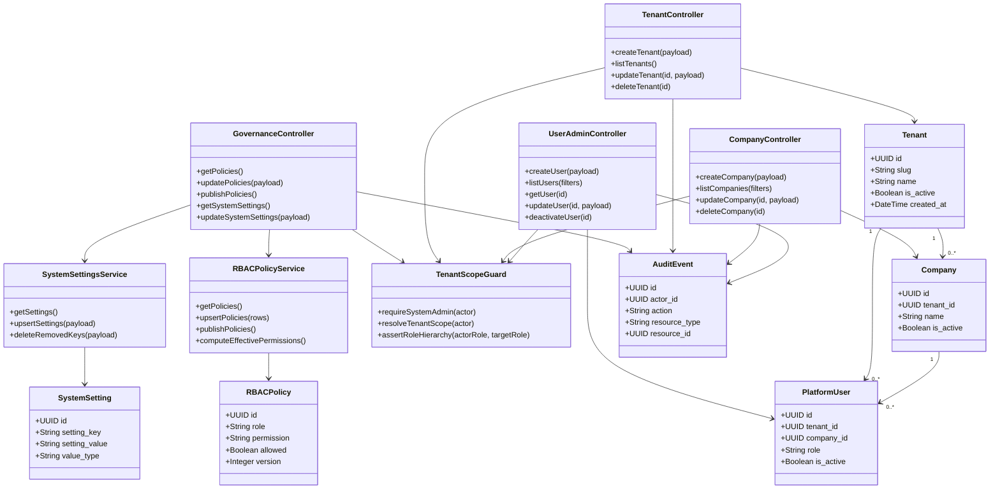
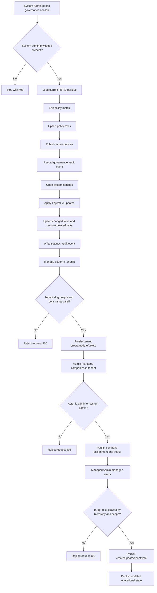
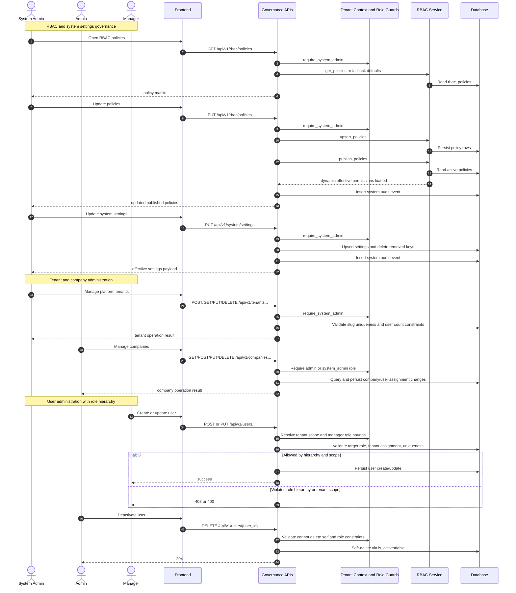

# P1: Governance and Setup (Endpoint-Level Phase Pack)

## Scope

Phase `P1` covers system-level governance: RBAC policies, system settings, tenant/company administration, and user management.

## Endpoint Inventory

| Method | Endpoint | Primary Actors | Guard |
|---|---|---|---|
| `GET` | `/rbac/policies` | System Admin | `require_system_admin` |
| `PUT` | `/rbac/policies` | System Admin | upsert + publish + audit |
| `POST` | `/rbac/policies/publish` | System Admin | publish dynamic permissions |
| `GET` | `/system/settings` | System Admin | `require_system_admin` |
| `PUT` | `/system/settings` | System Admin | upsert + audit |
| `POST/GET/PUT/DELETE` | `/tenants` and `/tenants/{id}` | System Admin | `require_system_admin` |
| `GET/POST/PUT/DELETE` | `/companies...` | Admin, System Admin | admin-only company operations |
| `GET/POST/GET/PUT/DELETE` | `/users...` | Manager+, Admin+, System Admin | role hierarchy + tenant scope |

## Domain Class Diagram

## Phase Flow Diagram

## Endpoint Sequence Diagram

