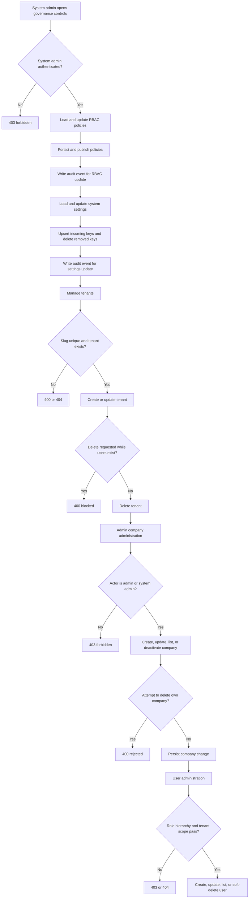
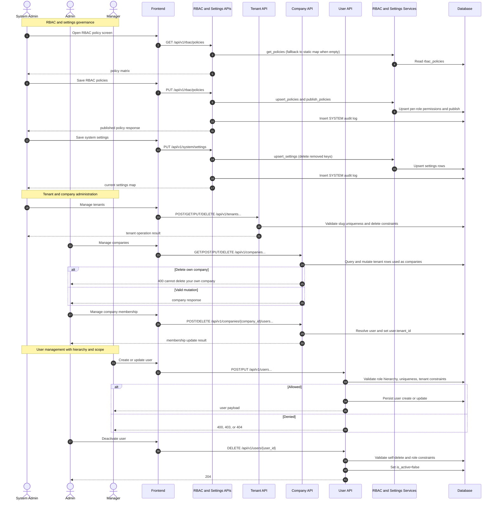

# P1: Governance and Setup (Endpoint-Level Phase Pack)

## Scope

Phase `P1` covers RBAC policy administration, system setting management, tenant/company administration, and platform user management.

## Endpoint Inventory

| Method | Endpoint | Primary Actors | Guard |
|---|---|---|---|
| `GET` | `/rbac/policies` | System Admin | `require_system_admin` tenant dependency |
| `PUT` | `/rbac/policies` | System Admin | Upsert policies + publish dynamic map + audit write |
| `POST` | `/rbac/policies/publish` | System Admin | Publish persisted policies to in-memory ACL |
| `GET` | `/system/settings` | System Admin | `require_system_admin` |
| `PUT` | `/system/settings` | System Admin | Upsert keys, delete removed keys, audit write |
| `POST/GET` | `/tenants` | System Admin | `require_system_admin` |
| `GET/PUT/DELETE` | `/tenants/{tenant_id}` | System Admin | `require_system_admin` + slug/user-count constraints |
| `GET` | `/tenants/{tenant_id}/users` | System Admin | `require_system_admin` |
| `GET/POST` | `/companies` | Admin, System Admin | Local `require_admin` role check |
| `GET/PUT/DELETE` | `/companies/{company_id}` | Admin, System Admin | Local `require_admin`; delete is soft deactivate |
| `GET/POST` | `/companies/{company_id}/users` | Admin, System Admin | Local `require_admin` + entity existence checks |
| `DELETE` | `/companies/{company_id}/users/{user_id}` | Admin, System Admin | Cannot remove self |
| `GET` | `/companies/{company_id}/documents` | Admin, System Admin | Local `require_admin` |
| `GET/POST` | `/users` | Manager, Admin, System Admin | Role hierarchy + tenant context scoping |
| `GET/PUT` | `/users/{user_id}` | Self, Manager, Admin, System Admin | Self-service allowed; admin path includes hierarchy checks |
| `DELETE` | `/users/{user_id}` | Admin, System Admin | Soft delete via `is_active=false`; cannot delete self |

## Domain Class Diagram

```mermaid
classDiagram
    class RbacPolicyRouter {
        +GET /rbac/policies
        +PUT /rbac/policies
        +POST /rbac/policies/publish
    }

    class SystemSettingsRouter {
        +GET /system/settings
        +PUT /system/settings
    }

    class TenantRouter {
        +POST /tenants
        +GET /tenants
        +GET /tenants/{tenant_id}
        +PUT /tenants/{tenant_id}
        +DELETE /tenants/{tenant_id}
        +GET /tenants/{tenant_id}/users
    }

    class CompanyRouter {
        +GET /companies
        +POST /companies
        +GET /companies/{company_id}
        +PUT /companies/{company_id}
        +DELETE /companies/{company_id}
        +GET /companies/{company_id}/users
        +POST /companies/{company_id}/users
        +DELETE /companies/{company_id}/users/{user_id}
    }

    class UserRouter {
        +GET /users
        +POST /users
        +GET /users/{user_id}
        +PUT /users/{user_id}
        +DELETE /users/{user_id}
    }

    class RbacService {
        +get_policies()
        +upsert_policies(policies, updated_by)
        +publish_policies()
    }

    class SystemSettingsService {
        +get_settings()
        +upsert_settings(settings, updated_by)
    }

    class TenantContext {
        +tenant_id: int?
        +user_id: int
        +user_role: UserRole
        +is_system_admin: bool
    }

    class RbacPolicy {
        +role: UserRole
        +permissions: json
        +is_active: bool
        +updated_by: int?
        +published_at: datetime?
    }

    class SystemSetting {
        +key: str
        +value: json
        +updated_by: int?
    }

    class Tenant {
        +id: int
        +name: str
        +slug: str
        +is_active: bool
        +company_type: str
    }

    class User {
        +id: int
        +email: str
        +username: str
        +role: UserRole
        +tenant_id: int?
        +is_active: bool
    }

    class AuditLog {
        +id: int
        +action: ActionType
        +details: str?
    }

    RbacPolicyRouter --> TenantContext
    RbacPolicyRouter --> RbacService
    RbacPolicyRouter --> AuditLog
    SystemSettingsRouter --> TenantContext
    SystemSettingsRouter --> SystemSettingsService
    SystemSettingsRouter --> AuditLog
    TenantRouter --> TenantContext
    TenantRouter --> Tenant
    CompanyRouter --> Tenant
    CompanyRouter --> User
    UserRouter --> TenantContext
    UserRouter --> User
    RbacService --> RbacPolicy
    SystemSettingsService --> SystemSetting
```

## Phase Flow Diagram



## Endpoint Sequence Diagram


