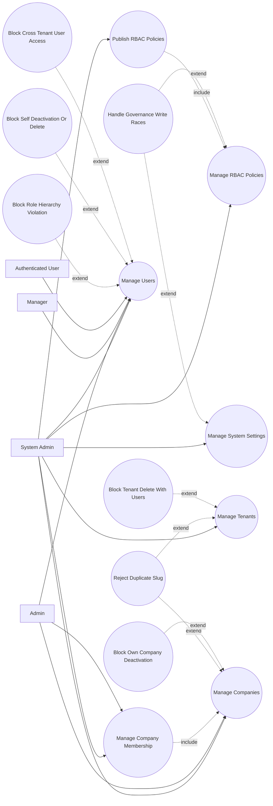

# P1: Governance and Setup - Use Case Diagram

## Actors

- `System Admin`
- `Admin`
- `Manager`
- `Authenticated User (Self-Service Profile)`

## Regular Use Cases

1. System admin reads and updates RBAC policies.
2. System admin publishes dynamic RBAC policy set.
3. System admin updates global system settings.
4. System admin manages tenants and tenant user listings.
5. Admin/system admin manages companies (create, update, deactivate, search).
6. Admin/system admin manages company membership assignments.
7. Manager/admin/system admin manages users with role hierarchy and tenant rules.

## Extreme and Edge Use Cases

1. Tenant or company slug collision on create/update.
2. Tenant deletion requested while users still exist.
3. Manager/admin attempts to assign a role outside hierarchy limits.
4. User attempts self-deactivation or self-deletion.
5. Non-system actor attempts cross-tenant user access.
6. Admin attempts to deactivate own company.
7. Concurrent governance edits produce stale write risk (no optimistic locking).

