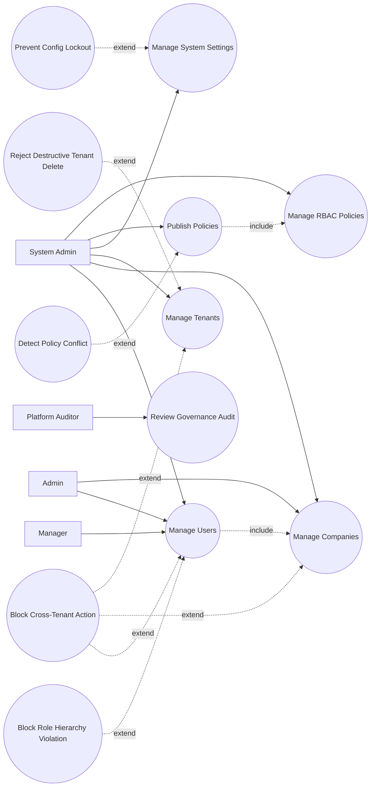

# P1: Governance and Setup - Use Case Diagram

## Actors

- `System Admin`
- `Admin`
- `Manager`
- `Platform Auditor`

## Regular Use Cases

1. System admin reads and updates RBAC policies.
2. System admin publishes active policy set.
3. System admin updates global system settings.
4. System admin manages tenants.
5. Admin manages companies within authorized scope.
6. Manager/admin manages users based on role hierarchy.
7. Auditor reviews governance and configuration audit logs.

## Extreme and Edge Use Cases

1. Policy publish introduces conflict or denies critical access.
2. Actor attempts cross-tenant management action without scope.
3. Manager attempts to create user above allowed role.
4. Tenant deletion requested while active dependencies exist.
5. Concurrent policy edits race and cause stale writes.
6. Admin attempts self-deactivation or privileged lockout scenario.
7. Invalid setting key/value type submitted.

