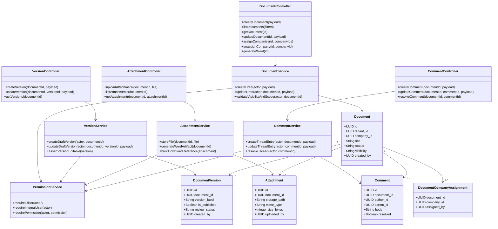

# P2: Authoring and Content Assembly - Class Diagram

```mermaid
classDiagram
    class DocumentController {
        +createDocument(payload)
        +listDocuments(filters)
        +getDocument(id)
        +updateDocument(id, payload)
        +assignCompanies(id, companyIds)
        +unassignCompany(id, companyId)
        +generateWord(id)
    }
    class VersionController {
        +createVersion(documentId, payload)
        +updateVersion(documentId, versionId, payload)
        +getVersions(documentId)
    }
    class AttachmentController {
        +uploadAttachment(documentId, file)
        +listAttachments(documentId)
        +getAttachment(documentId, attachmentId)
    }
    class CommentController {
        +createComment(documentId, payload)
        +updateComment(documentId, commentId, payload)
        +resolveComment(documentId, commentId)
    }
    class DocumentService {
        +createDraft(actor, payload)
        +updateDraft(actor, documentId, payload)
        +validateVisibilityAndScope(actor, documentId)
    }
    class VersionService {
        +createDraftVersion(actor, documentId)
        +updateDraftVersion(actor, documentId, versionId, payload)
        +assertVersionEditable(version)
    }
    class AttachmentService {
        +storeFile(documentId, file)
        +generateWordArtifact(documentId)
        +buildDownloadReference(attachment)
    }
    class CommentService {
        +createThreadEntry(actor, documentId, payload)
        +updateThreadEntry(actor, commentId, payload)
        +resolveThread(actor, commentId)
    }
    class PermissionService {
        +requireEditor(actor)
        +requireInternalUser(actor)
        +requirePermission(actor, permission)
    }
    class Document {
        +UUID id
        +UUID tenant_id
        +UUID company_id
        +String title
        +String status
        +String visibility
        +UUID created_by
    }
    class DocumentVersion {
        +UUID id
        +UUID document_id
        +String version_label
        +Boolean is_published
        +String review_status
        +UUID created_by
    }
    class Attachment {
        +UUID id
        +UUID document_id
        +String storage_path
        +String mime_type
        +Integer size_bytes
        +UUID uploaded_by
    }
    class Comment {
        +UUID id
        +UUID document_id
        +UUID author_id
        +UUID parent_id
        +String body
        +Boolean resolved
    }
    class DocumentCompanyAssignment {
        +UUID document_id
        +UUID company_id
        +UUID assigned_by
    }

    DocumentController --> DocumentService
    VersionController --> VersionService
    AttachmentController --> AttachmentService
    CommentController --> CommentService
    DocumentService --> PermissionService
    VersionService --> PermissionService
    AttachmentService --> PermissionService
    CommentService --> PermissionService
    DocumentService --> Document
    VersionService --> DocumentVersion
    AttachmentService --> Attachment
    CommentService --> Comment
    Document "1" --> "0..*" DocumentVersion
    Document "1" --> "0..*" Attachment
    Document "1" --> "0..*" Comment
    Document "1" --> "0..*" DocumentCompanyAssignment
```
