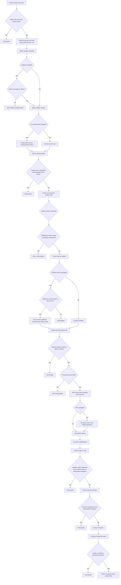

# P2: Authoring and Content Assembly - Flow Diagram

```mermaid
flowchart TD
    A[Editor creates document] --> B{Editor role and tenant context valid?}
    B -- No --> B1[403 denied]
    B -- Yes --> C[Persist document and auto-create initial version 1.0.0]

    C --> D[Editor updates metadata]
    D --> E{Visibility changed?}
    E -- Yes --> E1{Actor is manager or above?}
    E1 -- No --> E2[403 visibility change denied]
    E1 -- Yes --> F[Apply visibility change]
    E -- No --> F
    F --> G{Any tracked field changed?}
    G -- Yes --> H[Create patch version carrying latest content]
    G -- No --> I[No new version row]

    H --> J[Version authoring path]
    I --> J
    J --> K{Create version requested while pending review exists?}
    K -- Yes --> K1[409 blocked]
    K -- No --> L[Create next semantic version draft]

    L --> M{Update version requested}
    M --> N{Published or latest review is pending or approved?}
    N -- Yes --> N1[400 or 409 blocked]
    N -- No --> O[Persist version update]

    O --> P{Publish version requested}
    P -- No --> Q[Continue drafting]
    P -- Yes --> R{Approved review exists for this version?}
    R -- No --> R1[409 blocked]
    R -- Yes --> S[Mark version published and document status active]

    S --> T[Attachment and import path]
    Q --> T
    T --> U{Upload endpoint used by editor or above?}
    U -- No --> U1[403 denied]
    U -- Yes --> V{File type and size valid?}
    V -- No --> V1[400 invalid upload]
    V -- Yes --> W[Store binary plus metadata and checksum]
    W --> X{PDF uploaded?}
    X -- Yes --> X1[Schedule reader-view artifact generation]
    X -- No --> Y[Skip reader artifact]
    X1 --> Y

    Y --> Z[Comment collaboration]
    Z --> AA[Create thread or reply]
    AA --> AB{Update content requested by non-author and non-admin/editor/manager?}
    AB -- Yes --> AB1[403 denied]
    AB -- No --> AC[Persist comment change]
    AC --> AD{Resolve requested by non-admin/editor/manager?}
    AD -- Yes --> AD1[403 denied]
    AD -- No --> AE[Persist resolution]

    AE --> AF[Company assignment path]
    AF --> AG{assign_companies permission present?}
    AG -- No --> AG1[403 denied]
    AG -- Yes --> AH[Attach or detach tenant assignments]
```
