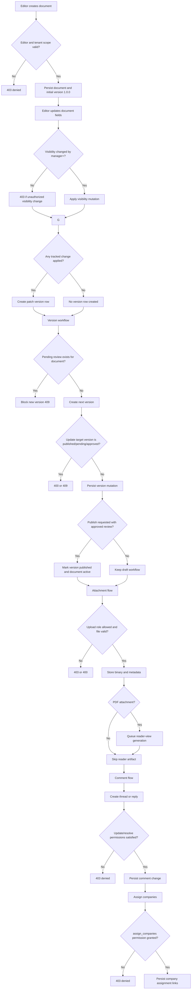
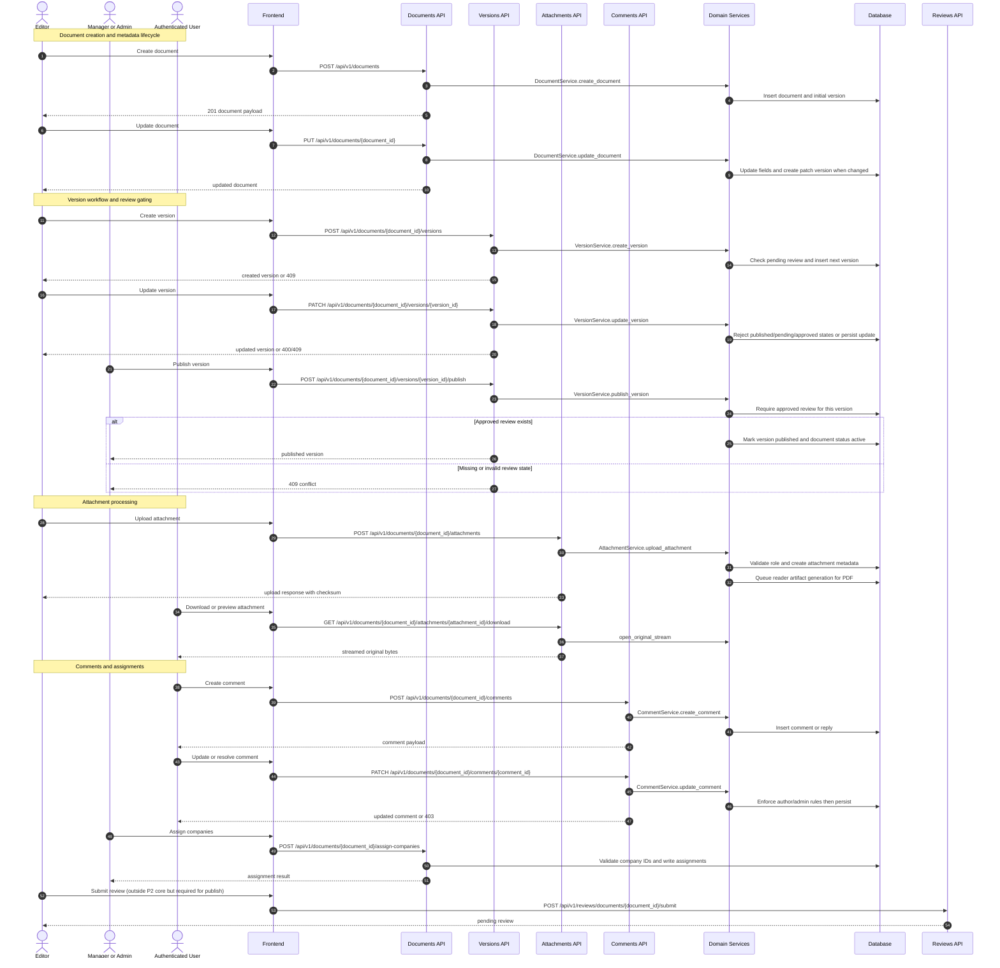

# P2: Authoring and Content Assembly (Endpoint-Level Phase Pack)

## Scope

Phase `P2` covers internal authoring operations: document lifecycle, version drafting/mutation, attachment handling, comments, and company assignment.

## Endpoint Inventory

| Method | Endpoint | Primary Actors | Guard |
|---|---|---|---|
| `POST` | `/documents` | Editor+ | `require_editor` + tenant-context document scope |
| `GET` | `/documents` | Internal users | `require_internal_user` + tenant-scoped query |
| `GET` | `/documents/{id}` | Internal users | `require_internal_user` + tenant-scoped lookup |
| `PUT` | `/documents/{id}` | Editor+ | `require_editor` + tenant-scoped access |
| `DELETE` | `/documents/{id}` | Manager+ | `require_manager` + tenant-scoped access |
| `POST` | `/documents/upload` | Editor+ | `require_editor`, upload validation, attachment write |
| `POST` | `/documents/{id}/generate-word` | Editor+ | `require_editor` + document access check |
| `GET` | `/documents/{id}/assigned-companies` | Internal users | `require_internal_user` |
| `POST/DELETE` | `/documents/{id}/assign-companies...` | Permission holders | `require_permission(assign_companies)` |
| `GET` | `/documents/{id}/versions`, `/documents/{id}/versions/{version_id}` | Authenticated users | Auth required (no explicit tenant guard in service) |
| `POST` | `/documents/{id}/versions` | Editor+ | Role check + blocked while any review is pending |
| `PATCH` | `/documents/{id}/versions/{version_id}` | Editor+ | Role check + cannot edit published/pending/approved version |
| `POST` | `/documents/{id}/versions/{version_id}/publish` | Manager+ | Role check + approved review required |
| `DELETE` | `/documents/{id}/versions/{version_id}` | Manager+ | Role check + unpublished only |
| `GET` | `/documents/{id}/attachments...` | Authenticated users | Auth required (download also accepts `?token=` query token) |
| `POST` | `/documents/{id}/attachments` | Admin, Manager, Editor, System Admin | Role check + type/size constraints |
| `DELETE` | `/documents/{id}/attachments/{attachment_id}` | Admin | Admin-only delete in service |
| `GET` | `/documents/{id}/comments...` | Authenticated users | Auth required + contributor-based visibility filtering |
| `POST` | `/documents/{id}/comments` | Authenticated users | Document existence check |
| `PATCH` | `/documents/{id}/comments/{comment_id}` | Author or admin/editor/manager | Content and resolve permission checks |
| `POST` | `/documents/{id}/comments/{comment_id}/resolve` | Admin, Manager, Editor | Resolve via comment update service |
| `DELETE` | `/documents/{id}/comments/{comment_id}` | Author, Admin, Manager, System Admin | Delete permission checks |

## Domain Class Diagram

```mermaid
classDiagram
    class DocumentRouter {
        +POST /documents
        +GET /documents
        +GET /documents/{document_id}
        +PUT /documents/{document_id}
        +DELETE /documents/{document_id}
        +POST /documents/upload
        +POST /documents/{document_id}/generate-word
        +POST /documents/{document_id}/assign-companies
    }

    class VersionRouter {
        +GET /documents/{document_id}/versions
        +POST /documents/{document_id}/versions
        +PATCH /documents/{document_id}/versions/{version_id}
        +POST /documents/{document_id}/versions/{version_id}/publish
        +DELETE /documents/{document_id}/versions/{version_id}
    }

    class AttachmentRouter {
        +GET /documents/{document_id}/attachments
        +GET /documents/{document_id}/attachments/{attachment_id}/download
        +GET /documents/{document_id}/attachments/{attachment_id}/reader-view
        +POST /documents/{document_id}/attachments
        +DELETE /documents/{document_id}/attachments/{attachment_id}
    }

    class CommentRouter {
        +GET /documents/{document_id}/comments
        +POST /documents/{document_id}/comments
        +PATCH /documents/{document_id}/comments/{comment_id}
        +POST /documents/{document_id}/comments/{comment_id}/resolve
        +DELETE /documents/{document_id}/comments/{comment_id}
    }

    class DocumentService {
        +create_document(...)
        +get_documents(...)
        +get_document(...)
        +update_document(...)
        +delete_document(...)
    }

    class VersionService {
        +create_version(...)
        +update_version(...)
        +publish_version(...)
        +delete_version(...)
    }

    class AttachmentService {
        +upload_attachment(...)
        +create_attachment_from_bytes(...)
        +get_reader_view(...)
        +delete_attachment(...)
    }

    class CommentService {
        +get_comments(...)
        +create_comment(...)
        +update_comment(...)
        +delete_comment(...)
    }

    class Document {
        +id: int
        +tenant_id: int?
        +document_number: str
        +status: DocumentStatus
        +visibility: DocumentVisibility
    }

    class Version {
        +id: int
        +document_id: int
        +version_number: int
        +semantic_version: str?
        +is_published: bool
    }

    class ReviewRequest {
        +document_id: int
        +version_id: int?
        +status: ReviewStatus
    }

    class Attachment {
        +id: int
        +document_id: int
        +mime_type: str
        +size_bytes: int?
        +sha256: str?
        +reader_html_status: str?
    }

    class Comment {
        +id: int
        +document_id: int
        +user_id: int
        +parent_id: int?
        +is_private: bool
        +is_resolved: bool
    }

    DocumentRouter --> DocumentService
    VersionRouter --> VersionService
    AttachmentRouter --> AttachmentService
    CommentRouter --> CommentService
    DocumentService --> Document
    VersionService --> Version
    VersionService --> ReviewRequest
    AttachmentService --> Attachment
    CommentService --> Comment
    Document "1" --> "0..*" Version
    Document "1" --> "0..*" Attachment
    Document "1" --> "0..*" Comment
```

## Phase Flow Diagram



## Endpoint Sequence Diagram


