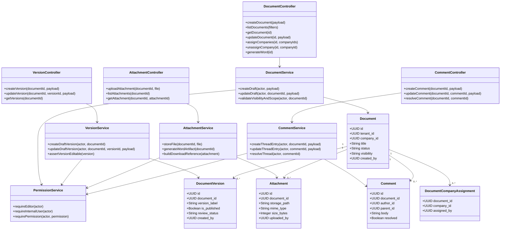
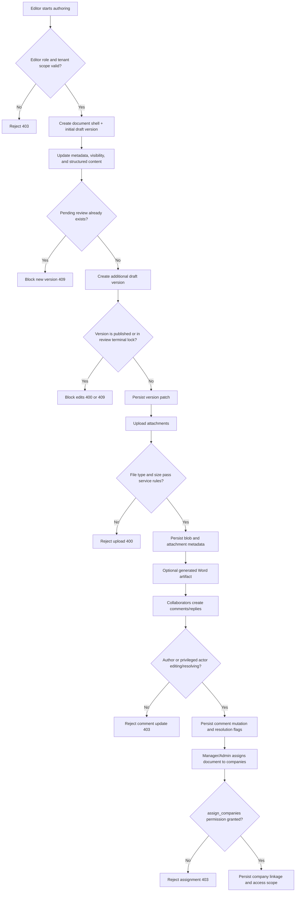
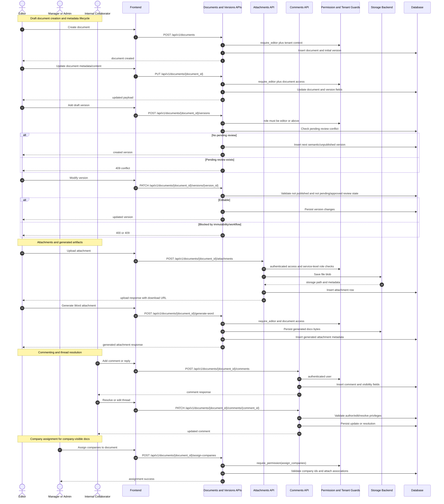

# P2: Authoring and Content Assembly (Endpoint-Level Phase Pack)

## Scope

Phase `P2` covers internal content creation, metadata updates, version drafting, attachments, comments, and company assignment.

## Endpoint Inventory

| Method | Endpoint | Primary Actors | Guard |
|---|---|---|---|
| `POST` | `/documents` | Editor+ | `require_editor` + tenant context |
| `POST` | `/documents/upload` | Editor+ | file/type/size checks |
| `POST` | `/documents/{id}/generate-word` | Editor+ | document access check |
| `GET` | `/documents` | Internal user | `require_internal_user` |
| `GET` | `/documents/{id}` | Internal user | tenant-scoped |
| `PUT` | `/documents/{id}` | Editor+ | content update and versioning rules |
| `POST` | `/documents/{id}/assign-companies` | Manager+ (permission) | `assign_companies` |
| `DELETE` | `/documents/{id}/assign-companies/{company_id}` | Manager+ (permission) | `assign_companies` |
| `POST` | `/documents/{id}/versions` | Editor+ | blocks if pending review exists |
| `PATCH` | `/documents/{id}/versions/{version_id}` | Editor+ | cannot edit published/approved/pending-review version |
| `POST` | `/documents/{id}/attachments` | Authenticated internal role with service checks | upload constraints |
| `GET` | `/documents/{id}/attachments...` | Authenticated user | access and metadata checks |
| `POST` | `/documents/{id}/comments` | Authenticated user | role-based visibility rules in service |
| `PATCH` | `/documents/{id}/comments/{comment_id}` | Author or admin/editor for resolve | ownership/role checks |
| `POST` | `/documents/{id}/comments/{comment_id}/resolve` | Admin/Editor | resolve-only operation |

## Domain Class Diagram

## Phase Flow Diagram

## Endpoint Sequence Diagram

