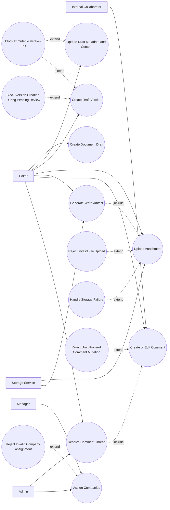

# P2: Authoring and Content Assembly - Use Case Diagram

## Actors

- `Editor`
- `Manager`
- `Admin`
- `Internal Collaborator`
- `Storage Service`

## Regular Use Cases

1. Editor creates draft document and initial version.
2. Editor updates metadata and structured content.
3. Editor creates additional draft versions.
4. Editor uploads attachments and generated artifacts.
5. Internal collaborator creates and updates comments.
6. Admin/editor resolves threads.
7. Manager/admin assigns companies to company-visible documents.

## Extreme and Edge Use Cases

1. New version request when pending review already exists.
2. Attempt to edit immutable or workflow-locked version.
3. Oversized or unsupported attachment upload.
4. Attachment processing/storage failure during upload.
5. Unauthorized comment edit/resolve attempt.
6. Invalid or unauthorized company assignment set.
7. Content payload schema mismatch causing partial updates.

