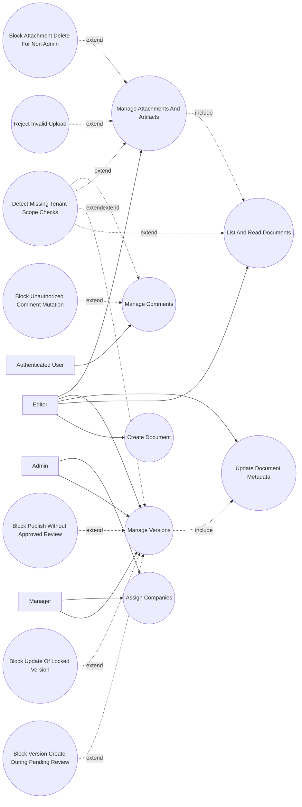

# P2: Authoring and Content Assembly - Use Case Diagram

## Actors

- `Editor`
- `Manager`
- `Admin`
- `Authenticated User`

## Regular Use Cases

1. Editor creates document with initial placeholder version.
2. Internal user lists/reads documents in authorized scope.
3. Editor updates documents; service creates patch versions when fields change.
4. Editor/manager/admin creates and updates versions under review-state rules.
5. Editor/manager/admin uploads attachments and generated artifacts.
6. Authenticated users create and maintain comment threads.
7. Permissioned manager/admin assigns companies to documents.

## Extreme and Edge Use Cases

1. New version request while pending review exists.
2. Attempt to update published or review-locked version.
3. Publish request without approved review.
4. Unsupported or oversized attachment upload.
5. Non-admin attempts attachment deletion.
6. Unauthorized comment content edit/resolve/delete operation.
7. Cross-tenant visibility risk on endpoints missing explicit scope checks.

