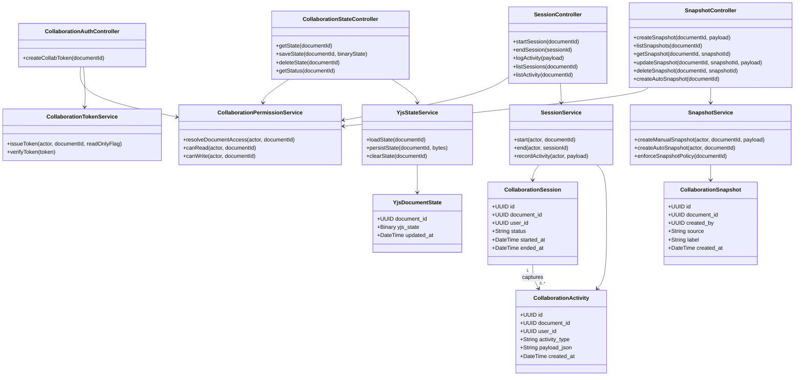

# P3: Real-Time Collaboration - Class Diagram

```mermaid
classDiagram
    class CollaborationAuthController {
        +createCollabToken(documentId)
    }
    class CollaborationStateController {
        +getState(documentId)
        +saveState(documentId, binaryState)
        +deleteState(documentId)
        +getStatus(documentId)
    }
    class SessionController {
        +startSession(documentId)
        +endSession(sessionId)
        +logActivity(payload)
        +listSessions(documentId)
        +listActivity(documentId)
    }
    class SnapshotController {
        +createSnapshot(documentId, payload)
        +listSnapshots(documentId)
        +getSnapshot(documentId, snapshotId)
        +updateSnapshot(documentId, snapshotId, payload)
        +deleteSnapshot(documentId, snapshotId)
        +createAutoSnapshot(documentId)
    }
    class CollaborationPermissionService {
        +resolveDocumentAccess(actor, documentId)
        +canRead(actor, documentId)
        +canWrite(actor, documentId)
    }
    class CollaborationTokenService {
        +issueToken(actor, documentId, readOnlyFlag)
        +verifyToken(token)
    }
    class YjsStateService {
        +loadState(documentId)
        +persistState(documentId, bytes)
        +clearState(documentId)
    }
    class SessionService {
        +start(actor, documentId)
        +end(actor, sessionId)
        +recordActivity(actor, payload)
    }
    class SnapshotService {
        +createManualSnapshot(actor, documentId, payload)
        +createAutoSnapshot(actor, documentId)
        +enforceSnapshotPolicy(documentId)
    }
    class CollaborationSession {
        +UUID id
        +UUID document_id
        +UUID user_id
        +String status
        +DateTime started_at
        +DateTime ended_at
    }
    class CollaborationActivity {
        +UUID id
        +UUID document_id
        +UUID user_id
        +String activity_type
        +String payload_json
        +DateTime created_at
    }
    class CollaborationSnapshot {
        +UUID id
        +UUID document_id
        +UUID created_by
        +String source
        +String label
        +DateTime created_at
    }
    class YjsDocumentState {
        +UUID document_id
        +Binary yjs_state
        +DateTime updated_at
    }

    CollaborationAuthController --> CollaborationPermissionService
    CollaborationAuthController --> CollaborationTokenService
    CollaborationStateController --> CollaborationPermissionService
    CollaborationStateController --> YjsStateService
    SessionController --> CollaborationPermissionService
    SessionController --> SessionService
    SnapshotController --> CollaborationPermissionService
    SnapshotController --> SnapshotService
    SessionService --> CollaborationSession
    SessionService --> CollaborationActivity
    SnapshotService --> CollaborationSnapshot
    YjsStateService --> YjsDocumentState
    CollaborationSession "1" --> "0..*" CollaborationActivity : captures
```
