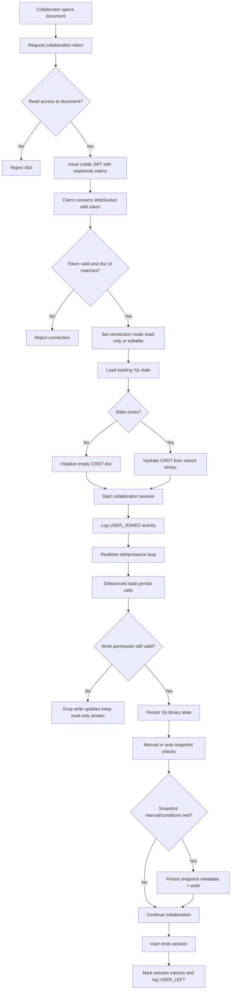

# P3: Real-Time Collaboration - Flow Diagram

```mermaid
flowchart TD
    A[Collaborator opens document] --> B[Request collaboration token]
    B --> C{Read access to document?}
    C -- No --> C1[Reject 403]
    C -- Yes --> D[Issue collab JWT with read/write claims]
    D --> E[Client connects WebSocket with token]
    E --> F{Token valid and doc id matches?}
    F -- No --> F1[Reject connection]
    F -- Yes --> G[Set connection mode read-only or editable]

    G --> H[Load existing Yjs state]
    H --> I{State exists?}
    I -- No --> I1[Initialize empty CRDT doc]
    I -- Yes --> J[Hydrate CRDT from stored binary]
    I1 --> K[Start collaboration session]
    J --> K

    K --> L[Log USER_JOINED activity]
    L --> M[Realtime edit/presence loop]
    M --> N[Debounced state persist calls]
    N --> O{Write permission still valid?}
    O -- No --> O1[Drop write updates keep read-only stream]
    O -- Yes --> P[Persist Yjs binary state]
    P --> Q[Manual or auto snapshot checks]
    Q --> R{Snapshot interval/conditions met?}
    R -- No --> S[Continue collaboration]
    R -- Yes --> T[Persist snapshot metadata + state]
    T --> S
    S --> U[User ends session]
    U --> V[Mark session inactive and log USER_LEFT]
```
