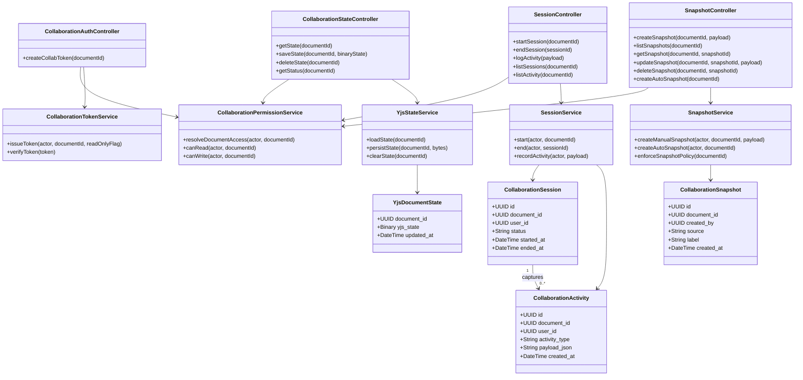
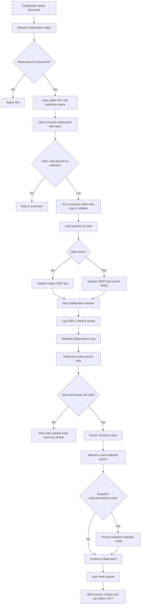
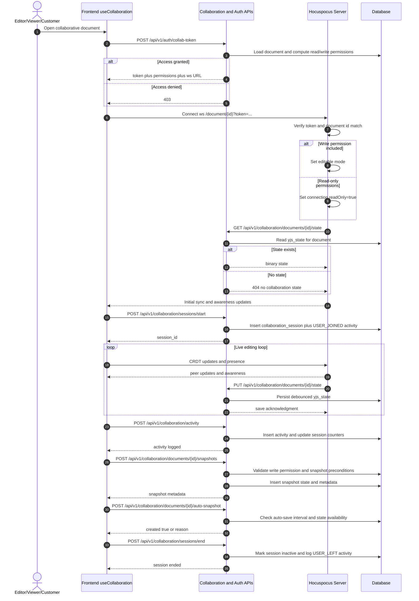

# P3: Real-Time Collaboration (Endpoint-Level Phase Pack)

## Scope

Phase `P3` covers collaboration token minting, WebSocket authentication, state hydration/persistence, session/activity tracking, and snapshot management.

## Endpoint Inventory

| Method | Endpoint | Primary Actors | Guard |
|---|---|---|---|
| `POST` | `/auth/collab-token` | Editor, Viewer, Customer (with access) | document-specific permissions |
| `GET` | `/collaboration/documents/{id}/state` | Collab server (on behalf of user) | read permission |
| `PUT` | `/collaboration/documents/{id}/state` | Collab server (on behalf of user) | write permission |
| `DELETE` | `/collaboration/documents/{id}/state` | Write-capable role | write permission |
| `GET` | `/collaboration/documents/{id}/status` | Any user with read access | read permission |
| `POST` | `/collaboration/sessions/start` | Collaborator | read access |
| `POST` | `/collaboration/sessions/end` | Collaborator | own active session |
| `POST` | `/collaboration/activity` | Collaborator | valid activity type |
| `GET` | `/collaboration/documents/{id}/activity` | Collaborator | read access |
| `GET` | `/collaboration/documents/{id}/sessions` | Collaborator | read access |
| `POST/GET/GET/PATCH/DELETE` | `/collaboration/documents/{id}/snapshots...` | Read or write role by operation | write required for mutating ops |
| `POST` | `/collaboration/documents/{id}/auto-snapshot` | Collaborator | state exists and interval permits |

WebSocket endpoint:
- `ws://<collab-host>:8002/document/{documentId}?token=<collab-jwt>`

## Domain Class Diagram

## Phase Flow Diagram

## Endpoint Sequence Diagram

