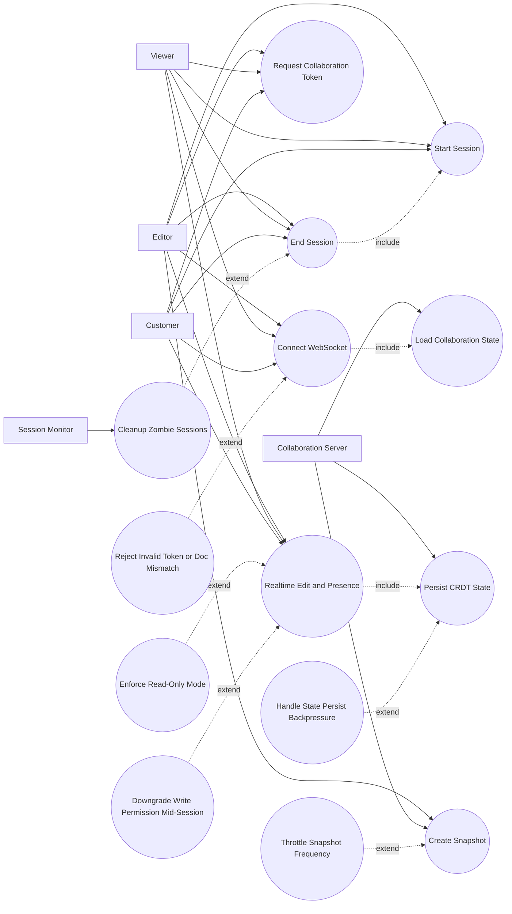

# P3: Real-Time Collaboration - Use Case Diagram

## Actors

- `Editor`
- `Viewer`
- `Customer`
- `Collaboration Server`
- `Session Monitor`

## Regular Use Cases

1. Collaborator requests document-scoped collaboration token.
2. Collaborator connects to document WebSocket channel.
3. Collaboration server hydrates document state.
4. Collaborator starts tracked collaboration session.
5. Collaborator edits/presence-updates in real-time.
6. Collaboration server persists debounced CRDT state.
7. User or service creates snapshot (manual or auto).
8. Collaborator ends session and activity is logged.

## Extreme and Edge Use Cases

1. Token is stale, invalid, or for wrong document id.
2. Read-only collaborator attempts write operation.
3. Network partition causes delayed state flush/retry burst.
4. Mid-session permission change revokes write access.
5. Snapshot flood attempts exceed policy limits.
6. Zombie sessions remain active after disconnect.
7. Activity spam degrades analytics or storage.

