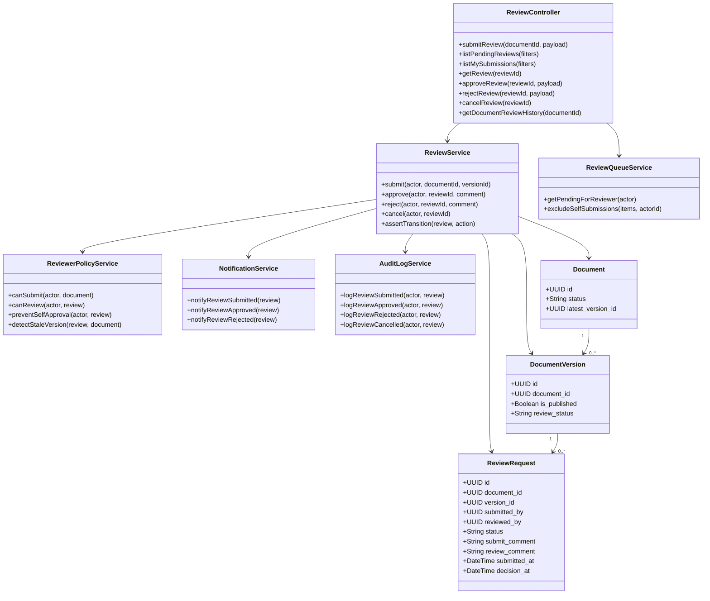

# P4: Review and Approval - Class Diagram

```mermaid
classDiagram
    class ReviewController {
        +submitReview(documentId, payload)
        +listPendingReviews(filters)
        +listMySubmissions(filters)
        +getReview(reviewId)
        +approveReview(reviewId, payload)
        +rejectReview(reviewId, payload)
        +cancelReview(reviewId)
        +getDocumentReviewHistory(documentId)
    }
    class ReviewService {
        +submit(actor, documentId, versionId)
        +approve(actor, reviewId, comment)
        +reject(actor, reviewId, comment)
        +cancel(actor, reviewId)
        +assertTransition(review, action)
    }
    class ReviewQueueService {
        +getPendingForReviewer(actor)
        +excludeSelfSubmissions(items, actorId)
    }
    class ReviewerPolicyService {
        +canSubmit(actor, document)
        +canReview(actor, review)
        +preventSelfApproval(actor, review)
        +detectStaleVersion(review, document)
    }
    class NotificationService {
        +notifyReviewSubmitted(review)
        +notifyReviewApproved(review)
        +notifyReviewRejected(review)
    }
    class AuditLogService {
        +logReviewSubmitted(actor, review)
        +logReviewApproved(actor, review)
        +logReviewRejected(actor, review)
        +logReviewCancelled(actor, review)
    }
    class ReviewRequest {
        +UUID id
        +UUID document_id
        +UUID version_id
        +UUID submitted_by
        +UUID reviewed_by
        +String status
        +String submit_comment
        +String review_comment
        +DateTime submitted_at
        +DateTime decision_at
    }
    class Document {
        +UUID id
        +String status
        +UUID latest_version_id
    }
    class DocumentVersion {
        +UUID id
        +UUID document_id
        +Boolean is_published
        +String review_status
    }

    ReviewController --> ReviewService
    ReviewController --> ReviewQueueService
    ReviewService --> ReviewerPolicyService
    ReviewService --> NotificationService
    ReviewService --> AuditLogService
    ReviewService --> ReviewRequest
    ReviewService --> Document
    ReviewService --> DocumentVersion
    Document "1" --> "0..*" DocumentVersion
    DocumentVersion "1" --> "0..*" ReviewRequest
```
