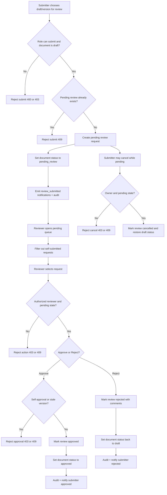

# P4: Review and Approval - Flow Diagram

```mermaid
flowchart TD
    A[Submitter chooses draft/version for review] --> B{Role can submit and document is draft?}
    B -- No --> B1[Reject submit 400 or 403]
    B -- Yes --> C{Pending review already exists?}
    C -- Yes --> C1[Reject submit 409]
    C -- No --> D[Create pending review request]
    D --> E[Set document status to pending_review]
    E --> F[Emit review_submitted notifications + audit]

    F --> G[Reviewer opens pending queue]
    G --> H[Filter out self-submitted requests]
    H --> I[Reviewer selects request]
    I --> J{Authorized reviewer and pending state?}
    J -- No --> J1[Reject action 403 or 409]
    J -- Yes --> K{Approve or Reject?}

    K -- Approve --> L{Self-approval or stale version?}
    L -- Yes --> L1[Reject approval 403 or 409]
    L -- No --> M[Mark review approved]
    M --> N[Set document status to approved]
    N --> O[Audit + notify submitter approved]

    K -- Reject --> P[Mark review rejected with comments]
    P --> Q[Set document status back to draft]
    Q --> R[Audit + notify submitter rejected]

    D --> S[Submitter may cancel while pending]
    S --> T{Owner and pending state?}
    T -- No --> T1[Reject cancel 403 or 409]
    T -- Yes --> U[Mark review cancelled and restore draft status]
```
