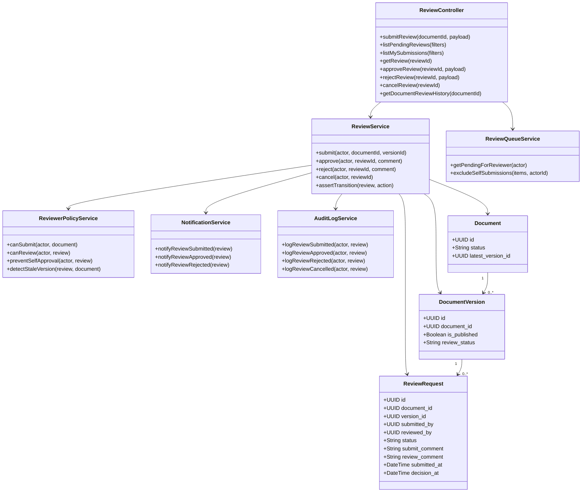
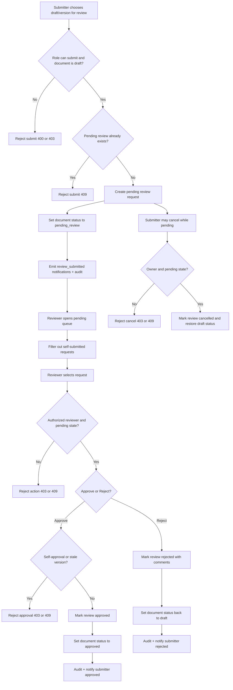
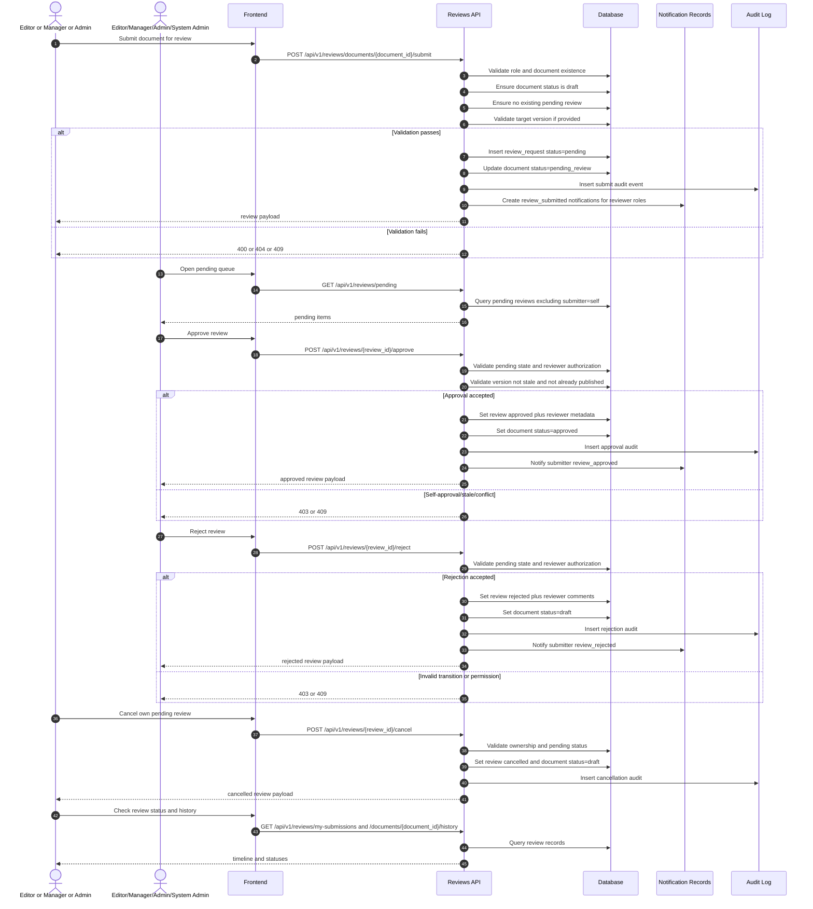

# P4: Review and Approval (Endpoint-Level Phase Pack)

## Scope

Phase `P4` covers submission, reviewer queues, approval/rejection/cancellation, and review history retrieval.

## Endpoint Inventory

| Method | Endpoint | Primary Actors | Guard |
|---|---|---|---|
| `POST` | `/reviews/documents/{document_id}/submit` | Editor+ | draft status + no pending review |
| `GET` | `/reviews/pending` | Reviewer roles | excludes own submissions |
| `GET` | `/reviews/my-submissions` | Submitter | own submissions |
| `GET` | `/reviews/{review_id}` | Submitter/reviewer roles | access check |
| `POST` | `/reviews/{review_id}/approve` | Reviewer roles | no self-approval + stale-version checks |
| `POST` | `/reviews/{review_id}/reject` | Reviewer roles | no self-action |
| `POST` | `/reviews/{review_id}/cancel` | Submitter | pending only |
| `GET` | `/reviews/documents/{document_id}/history` | Internal reviewer context | document exists |

## Domain Class Diagram

## Phase Flow Diagram

## Endpoint Sequence Diagram

