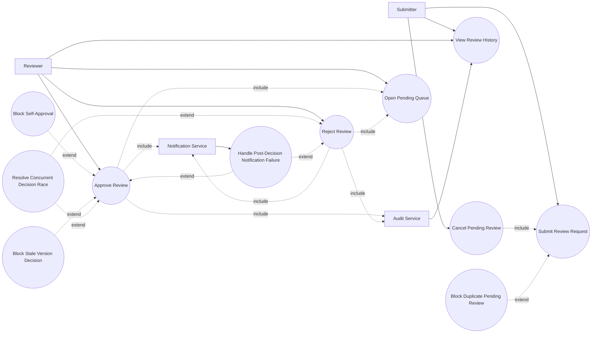

# P4: Review and Approval - Use Case Diagram

## Actors

- `Submitter (Editor/Manager/Admin)`
- `Reviewer (Editor/Manager/Admin/System Admin)`
- `Notification Service`
- `Audit Service`

## Regular Use Cases

1. Submitter submits a draft/version for review.
2. Reviewer opens pending queue excluding own submissions.
3. Reviewer approves request and document becomes approved.
4. Reviewer rejects request and document returns to draft.
5. Submitter cancels own pending review.
6. Internal actors inspect review history timeline.

## Extreme and Edge Use Cases

1. Submit request when pending review already exists.
2. Reviewer attempts self-approval.
3. Reviewer acts on stale/non-current version.
4. Concurrent approve/reject race on same request.
5. Unauthorized reviewer attempts action outside scope.
6. Submitter attempts cancel after final decision.
7. Notification or audit emit failure after state transition.

