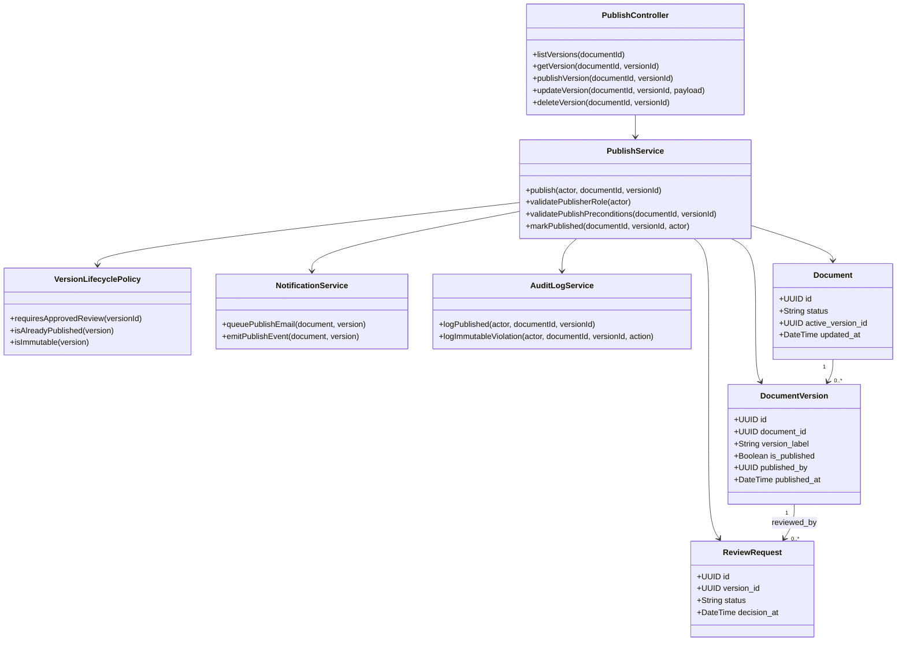

# P5: Publish and Release - Class Diagram

```mermaid
classDiagram
    class PublishController {
        +listVersions(documentId)
        +getVersion(documentId, versionId)
        +publishVersion(documentId, versionId)
        +updateVersion(documentId, versionId, payload)
        +deleteVersion(documentId, versionId)
    }
    class PublishService {
        +publish(actor, documentId, versionId)
        +validatePublisherRole(actor)
        +validatePublishPreconditions(documentId, versionId)
        +markPublished(documentId, versionId, actor)
    }
    class VersionLifecyclePolicy {
        +requiresApprovedReview(versionId)
        +isAlreadyPublished(version)
        +isImmutable(version)
    }
    class NotificationService {
        +queuePublishEmail(document, version)
        +emitPublishEvent(document, version)
    }
    class AuditLogService {
        +logPublished(actor, documentId, versionId)
        +logImmutableViolation(actor, documentId, versionId, action)
    }
    class Document {
        +UUID id
        +String status
        +UUID active_version_id
        +DateTime updated_at
    }
    class DocumentVersion {
        +UUID id
        +UUID document_id
        +String version_label
        +Boolean is_published
        +UUID published_by
        +DateTime published_at
    }
    class ReviewRequest {
        +UUID id
        +UUID version_id
        +String status
        +DateTime decision_at
    }

    PublishController --> PublishService
    PublishService --> VersionLifecyclePolicy
    PublishService --> NotificationService
    PublishService --> AuditLogService
    PublishService --> Document
    PublishService --> DocumentVersion
    PublishService --> ReviewRequest
    Document "1" --> "0..*" DocumentVersion
    DocumentVersion "1" --> "0..*" ReviewRequest : reviewed_by
```
