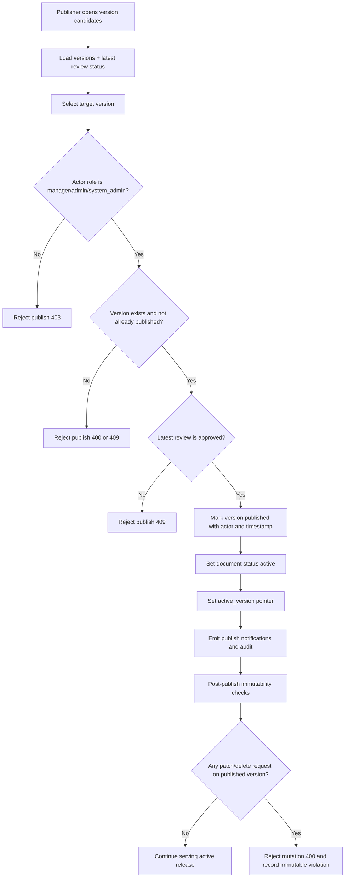

# P5: Publish and Release - Flow Diagram

```mermaid
flowchart TD
    A[Publisher opens version candidates] --> B[Load versions + latest review status]
    B --> C[Select target version]
    C --> D{Actor role is manager/admin/system_admin?}
    D -- No --> D1[Reject publish 403]
    D -- Yes --> E{Version exists and not already published?}
    E -- No --> E1[Reject publish 400 or 409]
    E -- Yes --> F{Latest review is approved?}
    F -- No --> F1[Reject publish 409]
    F -- Yes --> G[Mark version published with actor and timestamp]
    G --> H[Set document status active]
    H --> I[Set active_version pointer]
    I --> J[Emit publish notifications and audit]

    J --> K[Post-publish immutability checks]
    K --> L{Any patch/delete request on published version?}
    L -- No --> M[Continue serving active release]
    L -- Yes --> N[Reject mutation 400 and record immutable violation]
```
