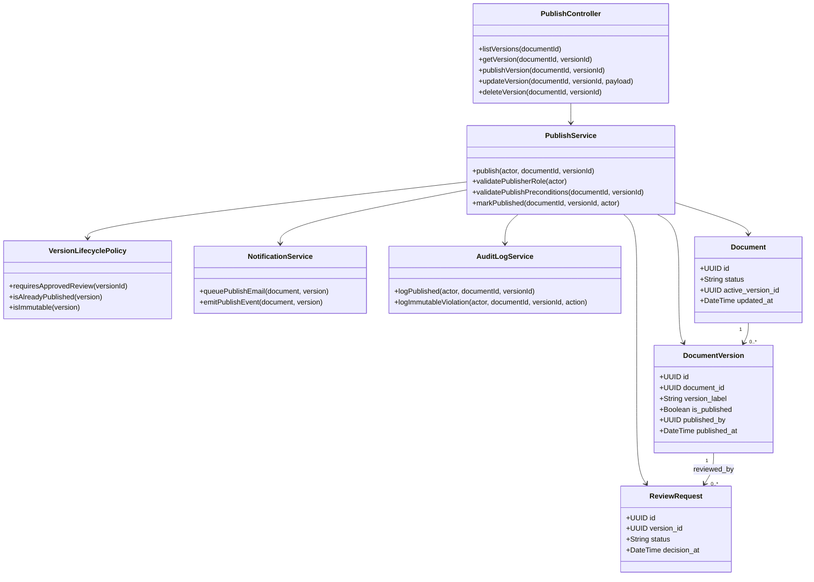
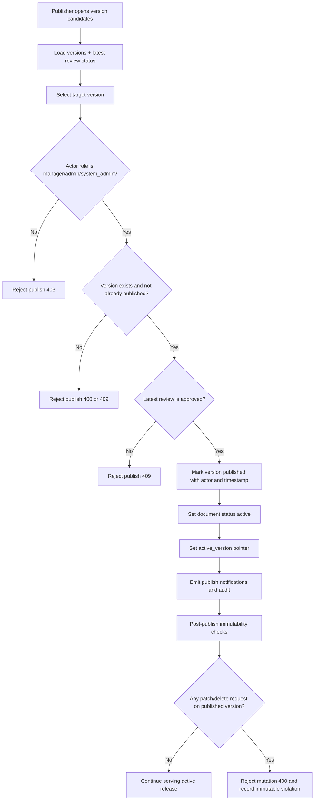
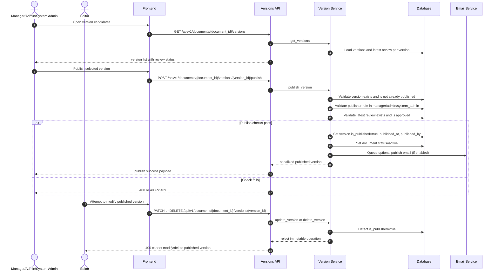

# P5: Publish and Release (Endpoint-Level Phase Pack)

## Scope

Phase `P5` covers release publication of an approved version, immutability transition, active status exposure, and downstream notifications.

## Endpoint Inventory

| Method | Endpoint | Primary Actors | Guard |
|---|---|---|---|
| `POST` | `/documents/{document_id}/versions/{version_id}/publish` | Manager, Admin, System Admin | version exists, not published, approved review exists |
| `GET` | `/documents/{document_id}/versions` | Internal users | used to inspect release candidates |
| `GET` | `/documents/{document_id}/versions/{version_id}` | Internal users | verify target version metadata |
| `PATCH` | `/documents/{document_id}/versions/{version_id}` | Editor+ | blocked after publish |
| `DELETE` | `/documents/{document_id}/versions/{version_id}` | Manager+ | blocked after publish |

## Domain Class Diagram

## Phase Flow Diagram

## Endpoint Sequence Diagram

