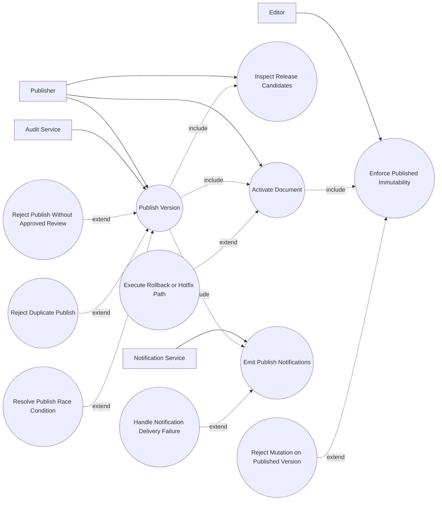

# P5: Publish and Release - Use Case Diagram

## Actors

- `Publisher (Manager/Admin/System Admin)`
- `Editor`
- `Notification Service`
- `Audit Service`

## Regular Use Cases

1. Publisher inspects release candidate versions.
2. Publisher publishes approved version.
3. System marks version as published and document as active.
4. Notification pipeline emits publish events.
5. Editor/internal users consume published immutable state.

## Extreme and Edge Use Cases

1. Publish attempt without approved review.
2. Publish attempt on already-published version.
3. Concurrent duplicate publish requests race.
4. Editor attempts mutation on published version.
5. Post-publish notification delivery failure.
6. Release needs rollback after publication.
7. Publish actor lacks role despite valid auth session.

