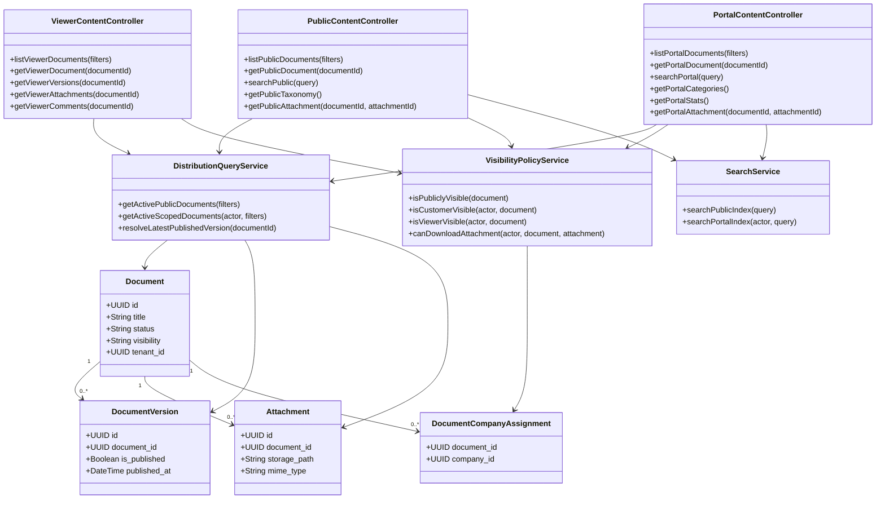

# P6: Distribution and Consumption - Class Diagram

```mermaid
classDiagram
    class PublicContentController {
        +listPublicDocuments(filters)
        +getPublicDocument(documentId)
        +searchPublic(query)
        +getPublicTaxonomy()
        +getPublicAttachment(documentId, attachmentId)
    }
    class ViewerContentController {
        +listViewerDocuments(filters)
        +getViewerDocument(documentId)
        +getViewerVersions(documentId)
        +getViewerAttachments(documentId)
        +getViewerComments(documentId)
    }
    class PortalContentController {
        +listPortalDocuments(filters)
        +getPortalDocument(documentId)
        +searchPortal(query)
        +getPortalCategories()
        +getPortalStats()
        +getPortalAttachment(documentId, attachmentId)
    }
    class DistributionQueryService {
        +getActivePublicDocuments(filters)
        +getActiveScopedDocuments(actor, filters)
        +resolveLatestPublishedVersion(documentId)
    }
    class VisibilityPolicyService {
        +isPubliclyVisible(document)
        +isCustomerVisible(actor, document)
        +isViewerVisible(actor, document)
        +canDownloadAttachment(actor, document, attachment)
    }
    class SearchService {
        +searchPublicIndex(query)
        +searchPortalIndex(actor, query)
    }
    class Document {
        +UUID id
        +String title
        +String status
        +String visibility
        +UUID tenant_id
    }
    class DocumentVersion {
        +UUID id
        +UUID document_id
        +Boolean is_published
        +DateTime published_at
    }
    class Attachment {
        +UUID id
        +UUID document_id
        +String storage_path
        +String mime_type
    }
    class DocumentCompanyAssignment {
        +UUID document_id
        +UUID company_id
    }

    PublicContentController --> DistributionQueryService
    ViewerContentController --> DistributionQueryService
    PortalContentController --> DistributionQueryService
    PortalContentController --> VisibilityPolicyService
    PublicContentController --> VisibilityPolicyService
    ViewerContentController --> VisibilityPolicyService
    PublicContentController --> SearchService
    PortalContentController --> SearchService
    DistributionQueryService --> Document
    DistributionQueryService --> DocumentVersion
    DistributionQueryService --> Attachment
    VisibilityPolicyService --> DocumentCompanyAssignment
    Document "1" --> "0..*" DocumentVersion
    Document "1" --> "0..*" Attachment
    Document "1" --> "0..*" DocumentCompanyAssignment
```
