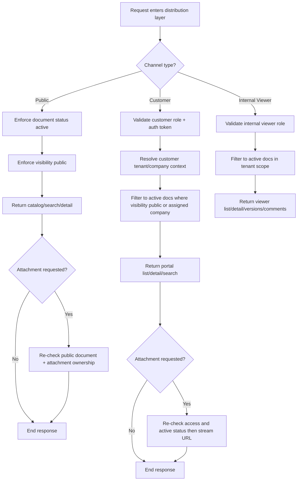

# P6: Distribution and Consumption - Flow Diagram

```mermaid
flowchart TD
    A[Request enters distribution layer] --> B{Channel type?}

    B -- Public --> C[Enforce document status active]
    C --> D[Enforce visibility public]
    D --> E[Return catalog/search/detail]
    E --> F{Attachment requested?}
    F -- No --> G[End response]
    F -- Yes --> H[Re-check public document + attachment ownership]
    H --> G

    B -- Customer --> I[Validate customer role + auth token]
    I --> J[Resolve customer tenant/company context]
    J --> K[Filter to active docs where visibility public or assigned company]
    K --> L[Return portal list/detail/search]
    L --> M{Attachment requested?}
    M -- No --> N[End response]
    M -- Yes --> O[Re-check access and active status then stream URL]
    O --> N

    B -- Internal Viewer --> P[Validate internal viewer role]
    P --> Q[Filter to active docs in tenant scope]
    Q --> R[Return viewer list/detail/versions/comments]
```
