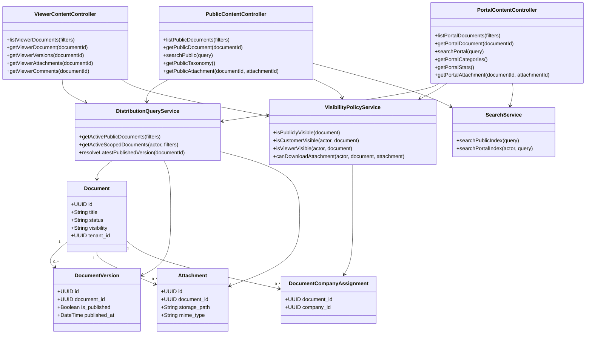
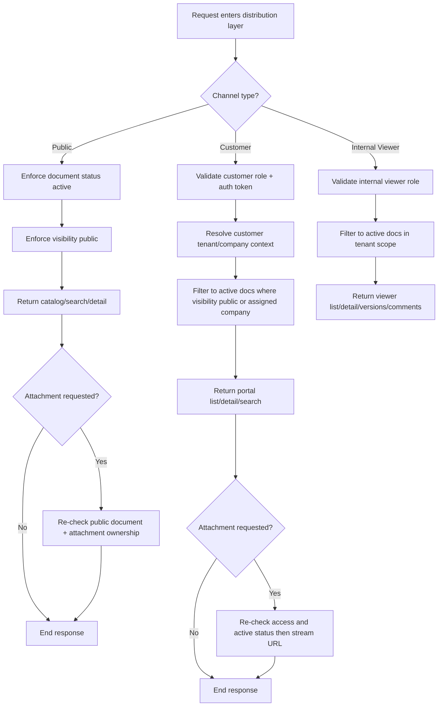
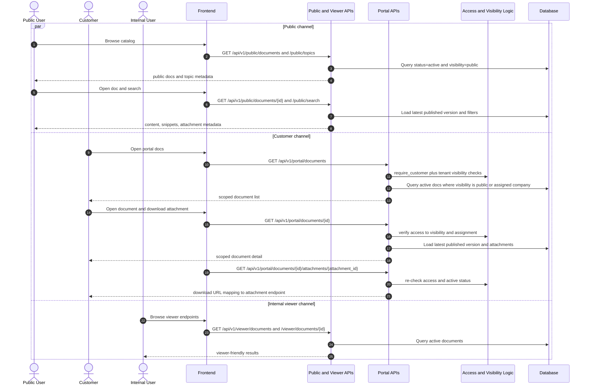

# P6: Distribution and Consumption (Endpoint-Level Phase Pack)

## Scope

Phase `P6` covers runtime content delivery across public, customer, and internal channels, including attachment access paths.

## Endpoint Inventory

| Channel | Method | Endpoint | Guard |
|---|---|---|---|
| Public | `GET` | `/public/documents` | `visibility=public` and `status=active` |
| Public | `GET` | `/public/documents/{document_id}` | same as above |
| Public | `GET` | `/public/search` | same as above |
| Public | `GET` | `/public/categories`, `/public/topics`, `/public/stats`, `/public/platforms/history` | public filters |
| Public | `GET` | `/public/documents/{document_id}/attachments/{attachment_id}` | public doc required |
| Viewer | `GET` | `/viewer/documents` and `/viewer/documents/{id}` | active docs only |
| Viewer | `GET` | `/viewer/documents/{id}/versions`, `/attachments`, `/comments` | active docs only |
| Customer | `GET` | `/portal/documents` | customer role + active + visibility rules |
| Customer | `GET` | `/portal/documents/{id}` | customer role + access check |
| Customer | `GET` | `/portal/search`, `/portal/categories`, `/portal/dashboard/stats` | customer role |
| Customer | `GET` | `/portal/documents/{id}/attachments/{attachment_id}` | access and status checks |

## Domain Class Diagram

## Phase Flow Diagram

## Endpoint Sequence Diagram

