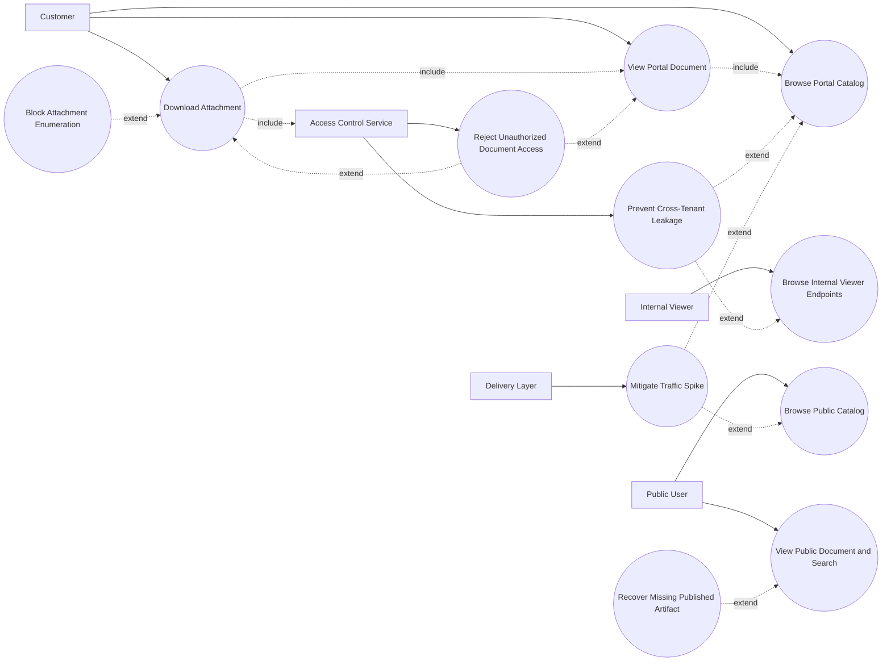

# P6: Distribution and Consumption - Use Case Diagram

## Actors

- `Public User`
- `Customer`
- `Internal Viewer`
- `Access Control Service`
- `Delivery Layer (API/CDN)`

## Regular Use Cases

1. Public user browses active public documents.
2. Public user opens details and performs public search.
3. Customer accesses portal-scoped document catalog.
4. Customer opens document and downloads authorized attachment.
5. Internal viewer uses internal read-only endpoints.
6. Delivery layer serves content and metadata efficiently.

## Extreme and Edge Use Cases

1. Unauthorized customer attempts access to non-assigned document.
2. Direct attachment URL guessing/enumeration attempt.
3. Cross-tenant data exposure attempt via filters.
4. Traffic spike causes latency or cache stampede.
5. Stale permission cache allows temporary over-access.
6. Active document has missing published artifact.
7. Search query abuse or scraping behavior.

