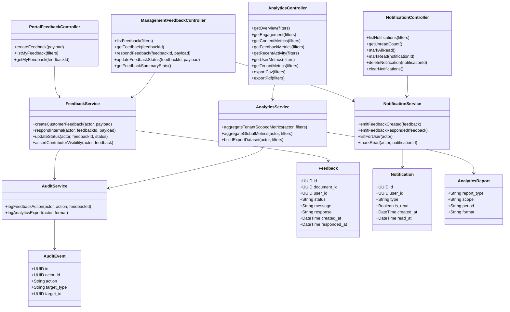

# P7: Feedback, Analytics, and Audit - Class Diagram

```mermaid
classDiagram
    class PortalFeedbackController {
        +createFeedback(payload)
        +listMyFeedback(filters)
        +getMyFeedback(feedbackId)
    }
    class ManagementFeedbackController {
        +listFeedback(filters)
        +getFeedback(feedbackId)
        +respondFeedback(feedbackId, payload)
        +updateFeedbackStatus(feedbackId, payload)
        +getFeedbackSummaryStats()
    }
    class NotificationController {
        +listNotifications(filters)
        +getUnreadCount()
        +markAllRead()
        +markRead(notificationId)
        +deleteNotification(notificationId)
        +clearNotifications()
    }
    class AnalyticsController {
        +getOverview(filters)
        +getEngagement(filters)
        +getContentMetrics(filters)
        +getFeedbackMetrics(filters)
        +getRecentActivity(filters)
        +getUserMetrics(filters)
        +getTenantMetrics(filters)
        +exportCsv(filters)
        +exportPdf(filters)
    }
    class FeedbackService {
        +createCustomerFeedback(actor, payload)
        +respondInternal(actor, feedbackId, payload)
        +updateStatus(actor, feedbackId, status)
        +assertContributorVisibility(actor, feedback)
    }
    class NotificationService {
        +emitFeedbackCreated(feedback)
        +emitFeedbackResponded(feedback)
        +listForUser(actor)
        +markRead(actor, notificationId)
    }
    class AnalyticsService {
        +aggregateTenantScopedMetrics(actor, filters)
        +aggregateGlobalMetrics(actor, filters)
        +buildExportDataset(actor, filters)
    }
    class AuditService {
        +logFeedbackAction(actor, action, feedbackId)
        +logAnalyticsExport(actor, format)
    }
    class Feedback {
        +UUID id
        +UUID document_id
        +UUID user_id
        +String status
        +String message
        +String response
        +DateTime created_at
        +DateTime responded_at
    }
    class Notification {
        +UUID id
        +UUID user_id
        +String type
        +Boolean is_read
        +DateTime created_at
        +DateTime read_at
    }
    class AnalyticsReport {
        +String report_type
        +String scope
        +String period
        +String format
    }
    class AuditEvent {
        +UUID id
        +UUID actor_id
        +String action
        +String target_type
        +UUID target_id
    }

    PortalFeedbackController --> FeedbackService
    ManagementFeedbackController --> FeedbackService
    ManagementFeedbackController --> NotificationService
    NotificationController --> NotificationService
    AnalyticsController --> AnalyticsService
    FeedbackService --> Feedback
    NotificationService --> Notification
    AnalyticsService --> AnalyticsReport
    FeedbackService --> AuditService
    AnalyticsService --> AuditService
    AuditService --> AuditEvent
```
