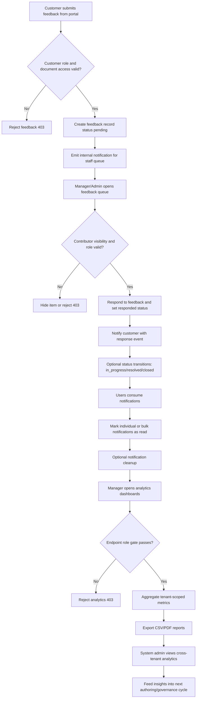

# P7: Feedback, Analytics, and Audit - Flow Diagram

```mermaid
flowchart TD
    A[Customer submits feedback from portal] --> B{Customer role and document access valid?}
    B -- No --> B1[Reject feedback 403]
    B -- Yes --> C[Create feedback record status pending]
    C --> D[Emit internal notification for staff queue]

    D --> E[Manager/Admin opens feedback queue]
    E --> F{Contributor visibility and role valid?}
    F -- No --> F1[Hide item or reject 403]
    F -- Yes --> G[Respond to feedback and set responded status]
    G --> H[Notify customer with response event]
    H --> I[Optional status transitions: in_progress/resolved/closed]

    I --> J[Users consume notifications]
    J --> K[Mark individual or bulk notifications as read]
    K --> L[Optional notification cleanup]

    L --> M[Manager opens analytics dashboards]
    M --> N{Endpoint role gate passes?}
    N -- No --> N1[Reject analytics 403]
    N -- Yes --> O[Aggregate tenant-scoped metrics]
    O --> P[Export CSV/PDF reports]
    P --> Q[System admin views cross-tenant analytics]
    Q --> R[Feed insights into next authoring/governance cycle]
```
