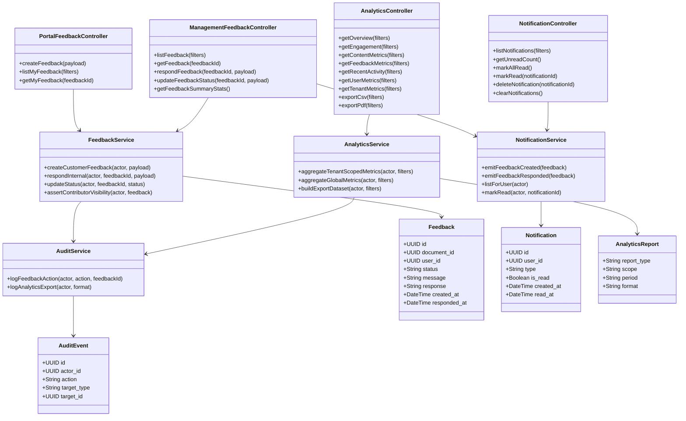
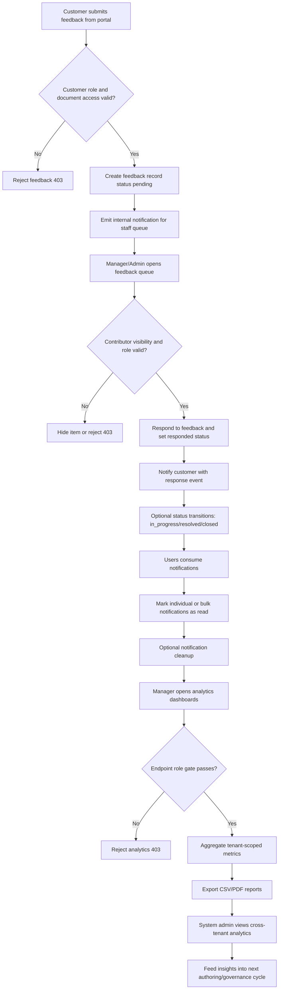
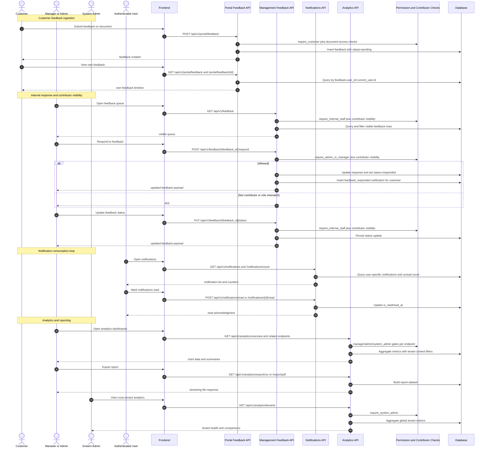

# P7: Feedback, Analytics, and Audit (Endpoint-Level Phase Pack)

## Scope

Phase `P7` covers feedback loops, internal response workflows, notification consumption, analytics reporting, and export flows.

## Endpoint Inventory

| Domain | Method | Endpoint | Guard |
|---|---|---|---|
| Portal feedback | `POST` | `/portal/feedback` | customer role + doc access |
| Portal feedback | `GET` | `/portal/feedback`, `/portal/feedback/{id}` | own feedback only |
| Mgmt feedback | `GET` | `/feedback`, `/feedback/{id}` | internal role + contributor visibility |
| Mgmt feedback | `POST` | `/feedback/{id}/respond` | admin/manager + contributor visibility |
| Mgmt feedback | `PUT` | `/feedback/{id}/status` | internal role + contributor visibility |
| Mgmt feedback | `GET` | `/feedback/stats/summary` | admin/manager/system_admin |
| Notifications | `GET` | `/notifications`, `/notifications/count` | current user |
| Notifications | `POST` | `/notifications/read`, `/notifications/{id}/read` | current user |
| Notifications | `DELETE` | `/notifications/{id}`, `/notifications` | current user |
| Analytics | `GET` | `/analytics/overview`, `/engagement`, `/content`, `/feedback`, `/recent-activity` | manager+ |
| Analytics | `GET` | `/analytics/users` | admin+ |
| Analytics | `GET` | `/analytics/tenants` | system_admin |
| Analytics export | `GET` | `/analytics/export/csv`, `/analytics/export/pdf` | manager+ |

## Domain Class Diagram

## Phase Flow Diagram

## Endpoint Sequence Diagram

