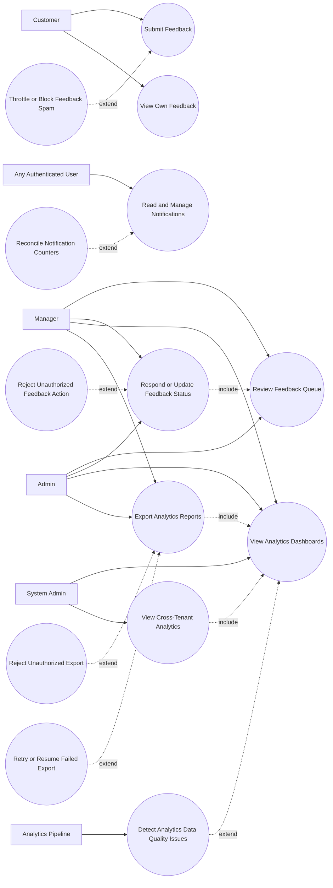

# P7: Feedback, Analytics, and Audit - Use Case Diagram

## Actors

- `Customer`
- `Manager`
- `Admin`
- `System Admin`
- `Any Authenticated User`
- `Analytics Pipeline`

## Regular Use Cases

1. Customer submits feedback for accessible document.
2. Customer tracks own feedback status.
3. Manager/admin views internal feedback queue.
4. Manager/admin responds and updates feedback status.
5. Users read and manage personal notifications.
6. Manager/admin/system admin opens analytics dashboards.
7. Manager/admin exports analytics reports.
8. System admin reviews cross-tenant analytics.

## Extreme and Edge Use Cases

1. Feedback spam or abuse from compromised accounts.
2. Unauthorized feedback response attempt by non-contributor.
3. Notification count drift or unread mismatch.
4. Analytics export requested outside allowed role/scope.
5. Data skew from late or malformed telemetry events.
6. Long-running export timeout or partial download failure.
7. Cross-tenant analytics data leak attempt.

