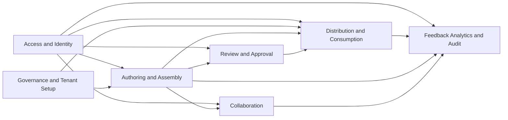

# Context Map Artifacts

This directory captures upstream/downstream dependencies across major bounded contexts.

## Primary Context Map

## Artifacts

- [contexts.md](./contexts.md): dependency catalog and integration expectations.

## Update Rule

Update this directory when a change:

- introduces a new upstream/downstream dependency
- changes ownership boundaries
- changes contract flow between backend/frontend/collab contexts
